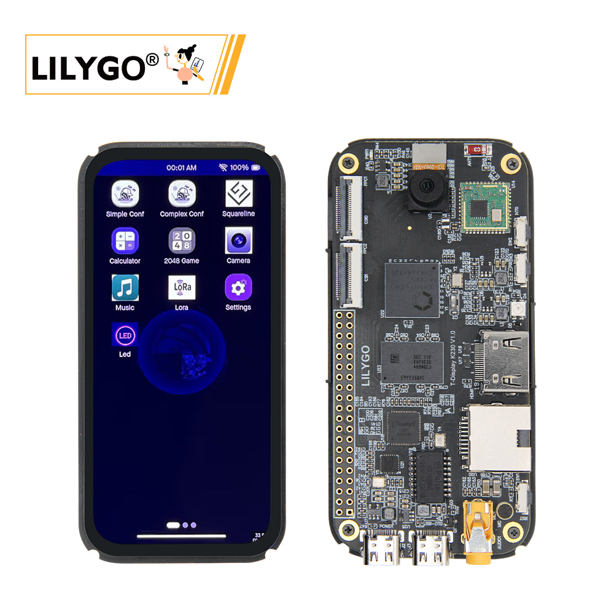

<!-- **[English](README.MD) | 中文** -->

<!-- 

    <a target="_blank" style="margin: 1em;color: white; font-size: 0.9em; border-radius: 0.3em; padding: 0.5em 2em; background-color:rgb(63, 201, 28)" href="https://item.taobao.com/item.htm?id=846226367137">淘宝</a>
    <a target="_blank" style="margin: 1em;color: white; font-size: 0.9em; border-radius: 0.3em; padding: 0.5em 2em; background-color:rgb(63, 201, 28)" href="https://www.aliexpress.com/store/911876460">速卖通</a>

 -->

## Introduction

T-Display K230 is a new product developed by Canaan Technology following the K210, based on their latest chip K230. It inherits the powerful computing capability of the K230 with a clock speed up to 1.6GHz, integrates LILYGO's signature LoRa communication and display features, and comes equipped with HDMI and Ethernet interfaces, offering developers broader application possibilities.

In terms of design, the T-Display K230 adopts a compact form factor suitable for handheld devices. It features a 4.1-inch high-quality AMOLED screen with capacitive touch support, delivering smooth visual and interactive experiences. We also provide a screen UI demo application to help developers get started quickly.

As a high-performance AIoT chip, the K230 boasts robust computing power and versatile expansion interfaces:

Dual-core RISC-V processor with clock speeds up to 1.6GHz for powerful performance

Integrated NPU (Neural Processing Unit) delivering up to 1.6 TOPS for AI inference acceleration

Built-in ISP (Image Signal Processor) optimized for camera image processing

Support for H.264 encoding, ideal for video streaming and edge computing

The combination of LoRa communication and ISP camera capabilities gives the T-Display K230 significant advantages in remote/wireless data transmission, AI recognition, IoT monitoring, and interactive applications. Join us in exploring the limitless possibilities of LoRa and AIoT!

## Appearance and function introduction
### Appearance

### Pinmap 

<!-- | 
Arduino IDE Setting  
 | 
Value
 |
|   :----------------------------------------------- | :------------------------------------------------ |
| Board                                    | **ESP32S3 Dev Module**
| Port                                     |Your port         
| USB CDC On Boot                          |Enable 
| CPU Frequency                            |240MHZ(WiFi)    
| Core Debug Level                         |None       
| USB DFU On Boot                          |disable            
| Erase All Flash Before Sketch Upload     |disable   
| Events Run On                            |Your port         
| Flash Mode                               |Enable 
| Flash Size                               |240MHZ(WiFi)    
| Arduino Runs On                          |None 
| USB Firmware MSC On Boot                 |disable            
| Partition Scheme                         |disable   
| PSRAM                                    |240MHZ(WiFi)    
| Upload Mode                              |None 
| Upload Speed                             |disable            
| USB Mode                                 |CDC and JTAG    -->

## Prameter

| Component | Description |
| --- | --- |
| CPU Big Core | 1.6GHz RISC-V 32KB I-cache, 32KB D-cache, 256KB L2 Cache，128bit RVV 1.0 extension |
| CPU small core | 0.8GHz RISC-V 32KB I-cache, 32KB D-cache, 128KB L2 Cache |
| KPU | supports INT8 and INT16 Typical network performance: Resnet 50 ≥ 85fps @INT8; Mobilenet_v2 ≥ 670fp@int8; YoloV5S ≥ 38fps @INT8|
| Memory | 8Gb LPDDR4  |
| Storage | TF Card |
| Camera | 3-channel MIPI CSI-2 input, supports 1/2/4-lane modes (1 channel configured by default, others optional) Max config: 3×2-lane or 1×4-lane + 1×2-lane Data rate up to 1.5Gbps  |
| Display | 30pin FPC interface: 4.1-inch 568×1232 AMOLED (2-lane MIPI DSI output)|
| Touch: 6pin capacitive touchscreen |
| HDMI |19pin HDMI port: Supports 1080P@30FPS|
| Audio Output | 3.5mm audio jack |
| Audio Input | Microphone (mic) |
| Network | 802.11b/g/n Wi-Fi ; IEEE 802.3u Ethernet  |
| LoRa | SX1262/SX1280, frequency bands: 433~923MHz (optional) |
| USB | 1 × POWER + 1 × USB 2.0 OTG( (dual-row expansion interface)) |
| IO Interface| 2.54mm pitch × 2*20 (dual-row expansion interface) |
| Buttons | 1 × RST button + 1 × BOOT button + 1 × INT0 button|
| LED | Power indicator + RGB LED |
| Codec | H.264/H.265 encoder/decoder, max resolution 4096×4096 Encoder performance: 3840×2160@20fps Decoder performance: 3840×2160@40fps JPEG codec: Supports up to 8K (8192×8192) resolution|
| Power | 5V/500mA input|
| Mounting Holes |4 × 2mm positioning holes|
| Dimensions |Main body (without case): 100×48×1.6mm |

## Related Links

## Software Design

## Product Technical Support

