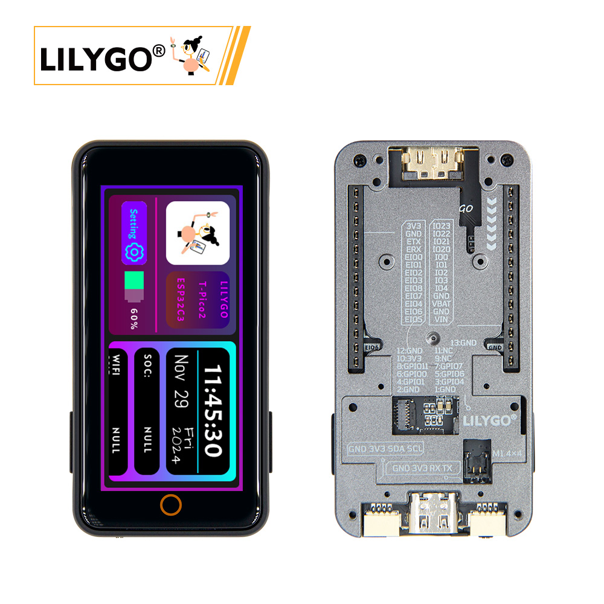
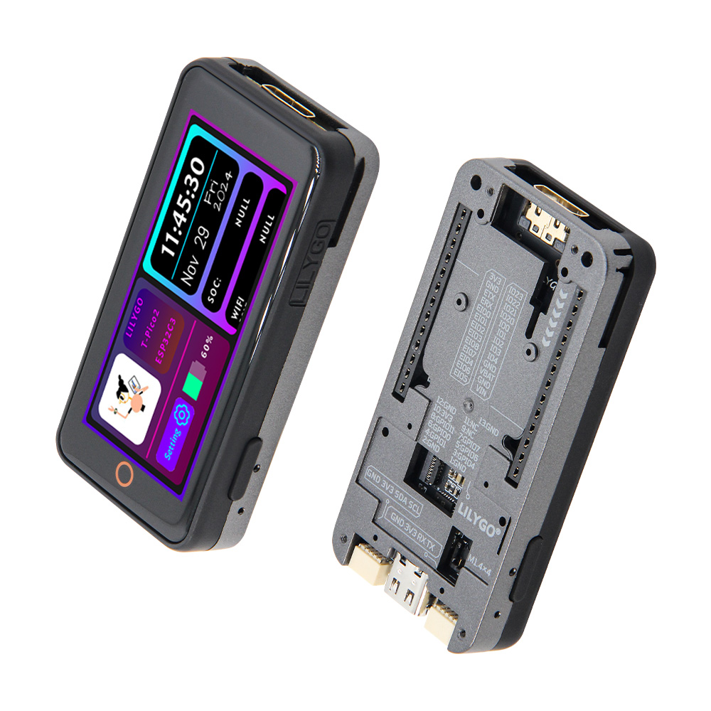
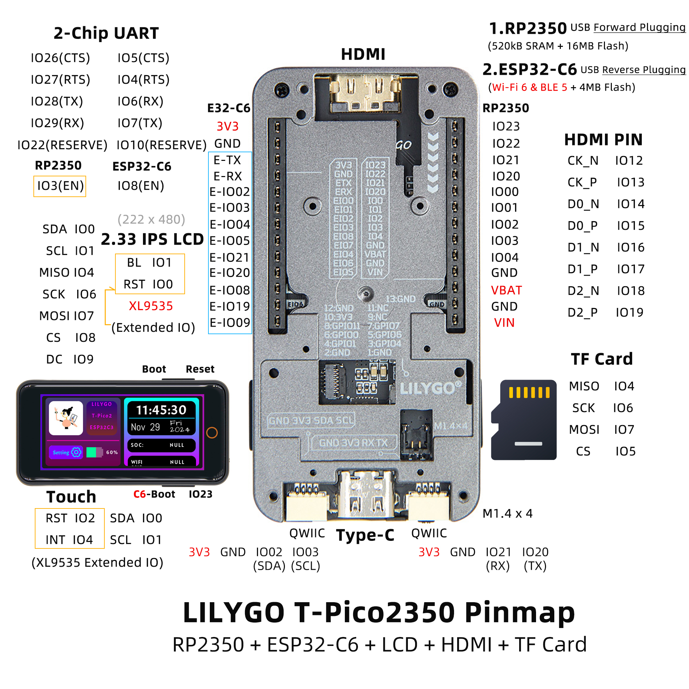

<!-- **[English](README.MD) | 中文** -->

<!-- 

    <a target="_blank" style="margin: 1em;color: white; font-size: 0.9em; border-radius: 0.3em; padding: 0.5em 2em; background-color:rgb(63, 201, 28)" href="https://item.taobao.com/item.htm?id=846226367137">淘宝</a>
    <a target="_blank" style="margin: 1em;color: white; font-size: 0.9em; border-radius: 0.3em; padding: 0.5em 2em; background-color:rgb(63, 201, 28)" href="https://www.aliexpress.com/store/911876460">速卖通</a>

 -->

## Overview

The T-Pico2350 is another version in the T-Pico series, designed and manufactured based on the Raspberry Pi RP2350 chip. It features an external expansion case design similar to the T-Display S3 Pro. This case is designed with multiple external expansion interfaces, supporting both pin header expansion and a 13-pin 0.3mm pitch FPC expansion interface. Additionally, the bottom is equipped with multiple M1.4 embedded brass nuts for secure expansion and mounting.

The device integrates RP2350 + ESP32-C6, a 2.33-inch capacitive touchscreen, TF card slot, HDMI interface, two QWIIC interfaces, and a PMU (Power Management Unit). It supports both battery power and USB power. The USB interface follows the T-Pico series design, allowing programming of both chips regardless of the insertion direction.

## Appearance and function introduction
### Appearance

### Pinmap 

## Module Information and Specifications
<table role="table" class="center_table">
  <thead>
    <tr>
      <th colspan = "2">Raspberry Pi</th>
    </tr>
  </thead>
    <tr>
    <td>CPU</td>
    <td>RP2350</td>
  </tr>
  <tr>
    <td>Flash</td>
    <td>16MB</td>
  </tr>
  <tr>
    <td>SRAM</td>
    <td>520kB</td>
  </tr>
</table>

<table role="table" class="center_table">
  <thead>
    <tr>
      <th colspan = "2">ESP32 Module</th>
    </tr>
  </thead>
    <tr>
    <td>MCU</td>
    <td>ESP32-C6-MINI-1U-N4</td>
  </tr>
  <tr>
    <td>Flash</td>
    <td>4MB</td>
  </tr>
  <tr>
    <td>Wireless Protocols</td>
    <td>2.4G WiFi 6 + Bluetooth (BLE)</td>
  </tr>
    <tr>
    <td>Wireless Standards</td>
    <td>802.11b/g/n</td>
  </tr>
</table>

### Development board parameter
| Component | Description |
| ---  | --- |
| Storage | TF Card |
| Screen | 2.33-inch IPS LCD |
| Touch | XL9535 IIC Protocol |
| HDMI | 19pin HDMI Interface |
| IO Interface | 2.54mm pitch × 2*13 Expansion IO Interface |
| Expansion Interface | 2 × QWIICInterfaces |
| Mounting Holes | M1.4mm *4  |

### Related Links
Github：[T-PICO-2350](https://github.com/Xinyuan-LilyGO/Lilygo-T-Pico2/tree/master)
#### Schematic Diagram

* [Light Sensor datasheet](https://github.com/lewisxhe/SensorLib/blob/master/datasheet/LTR-553ALS-01.pdf)
* [RP2350](https://www.raspberrypi.com/documentation/microcontrollers/silicon.html#rp2350)
* [ST7796S](http://www.lcdwiki.com/res/MSP4021/ST7796S-Sitronix.pdf)
* [CST226SE](https://github.com/lewisxhe/SensorLib/blob/master/datasheet/%E6%B5%B7%E6%A0%8E%E5%88%9B%E8%A7%A6%E6%91%B8%E8%8A%AF%E7%89%87%E7%A7%BB%E6%A4%8D%E6%89%8B%E5%86%8C-v3.5-20220701(1).pdf)
<!-- * [SY6970](./datasheet/AN_SY6970.pdf) -->

#### Dependency Libraries

* [lvgl 8.3.9](https://github.com/lvgl/lvgl)
* [AceButton](https://github.com/bxparks/AceButton)
* [TFT_eSPI](https://github.com/Bodmer/TFT_eSPI)
* [Arduino_GFX](https://github.com/moononournation/Arduino_GFX)
* [WiFiEspAT](https://github.com/jandrassy/WiFiEspAT)
* [XPowersLib](https://github.com/lewisxhe/XPowersLib)
* [SensorLib](https://github.com/lewisxhe/SensorsLib)
* [MPU9250](https://github.com/bolderflight/MPU9250)
* [Adafruit_BME280_Library](https://github.com/adafruit/Adafruit_BME280_Library)
* [TinyGPSPlus](https://github.com/mikalhart/TinyGPSPlus)

## Software Design
### Arduino Set Parameters

| Setting                               | Value                                 |
| :-------------------------------: | :-------------------------------: |
| Board                                 | Generic RP2350           |
| Debug Level                    | None                               |
| Debug Port                           | Serial     |
| C++ Exceptions            | Disabled                              |
| Flash size                 | 16MB (no FS)                           |
| CPU Speed                | 150 MHz                          |
| IP/Bluetooth stack                  | lPv4 Only                    |
| Optimize:                     | Small (-Os) (standard)                |
| PSRAM Size                           | OMByte PSRAM                    |
| RTTI                           | Disabled                    |
| Stack Protector                | Disabled |
| Upload Method                   | Default (UF2)           |
| USB Stack                   | Pico SDK                               |
     

### Development Platform
1. [C](https://github.com/Xk-w/Arduino_DriveBus)
2. [Arduino IDE](https://www.arduino.cc/en/software)
3. [Platform IO](https://github.com/Xk-w/Arduino_DriveBus)

## Product Technical Support

