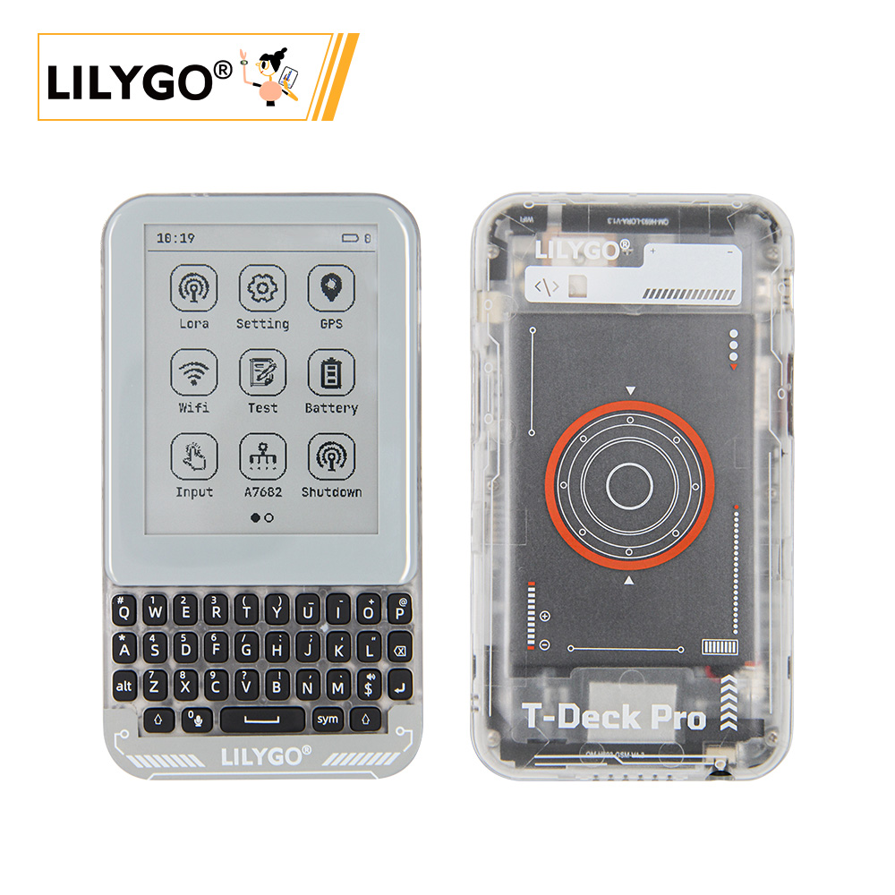

<!-- **[English](README.MD) | 中文** -->

<!-- 

    <a target="_blank" style="margin: 1em;color: white; font-size: 0.9em; border-radius: 0.3em; padding: 0.5em 2em; background-color:rgb(63, 201, 28)" href="https://item.taobao.com/item.htm?id=846226367137">淘宝</a>
    <a target="_blank" style="margin: 1em;color: white; font-size: 0.9em; border-radius: 0.3em; padding: 0.5em 2em; background-color:rgb(63, 201, 28)" href="https://www.aliexpress.com/store/911876460">速卖通</a>

 -->

## Introduction

The LILYGO T-Deck Pro is a highly integrated, multifunctional development platform based on the ESP32-S3 chip. It supports 4G communication and LoRa long-range wireless transmission, featuring an E Ink display (EPD) with touch functionality for low-power display and interaction.

Its hardware modules include GPS positioning, a gyroscope sensor, a microphone for voice input, SD card storage, a mechanical keyboard, and a self-learning AI IMU, making it suitable for IoT, outdoor devices, and smart terminals.

Designed in two versions:

Version 1 focuses on basic communication and display.

Version 2 enhances audio processing and expands storage capabilities.

This flexible configuration meets diverse needs, including industrial control, environmental monitoring, and portable devices.

## Appearance and function introduction
### Appearance

### 引脚图 

## 模块资料
### 概述

| 组件 | 描述 |
| --- | --- |
| MCU | ESP32-53FN16R8 Dual-core LX7 microprocessor
| FLASH| 16MB |
| PSRAM | 	8MB|
| GPS | MIA-M10Q |
| LoRa | SX1262:433~920Mhz |
| 存储 | TF 卡 |
| 4G-Module | A7682E 可选 |
| 无线 | 2.4 GHz Wi-Fi, Bluetooth 5 (LE)
| 通讯 | SIM 卡|
| USB | 1 × USB Port and OTG(TYPE-C接口) |
| 拓展接口 | 1 × QWIIC接口 |
| 陀螺仪 | BHI260AP |
| 电机 | IO电平控制|
| 音频 | PCM512A 可选|
| IO 接口 | 2.54mm间距 × 2*20（双排）拓展IO接口 |
| 按键 | 1 x RESET 按键 + 1 x BOOT 按键 |
| 屏幕 | GDEQ031T10 3.1 inch 墨水屏 320x240|
| 触摸 | CST328  |
| 电池容量 | 3.7V-1500mAh |
| 电池芯片 | BQ25896/BQ27220  |
| 键盘 | TCA8418 |
| 灯光传感器 | LTR_553ALS|
| 电源 | 5V/500mA |
| 孔位 | **2mm定位孔 *2** |
| 尺寸 | **120x66x13.5mm**  |
### 相关资料链接

Github:[T-Deck Pro](https://github.com/Xinyuan-LilyGO/T-Deck-Pro)

- [MAX98357A](https://github.com/Xinyuan-LilyGO/T3-S3-MVSRBoard/blob/main/information/MAX98357AETE+T.pdf)
- [MSM261S4030H0R](https://github.com/Xinyuan-LilyGO/T3-S3-MVSRBoard/blob/main/information/MEMSensing-MSM261S4030H0R.pdf)
- [PCF85063ATL](https://github.com/Xinyuan-LilyGO/T3-S3-MVSRBoard/blob/main/information/PCF85063ATL-1,118.pdf)
- [MP34DT05-A](https://github.com/Xinyuan-LilyGO/T3-S3-MVSRBoard/blob/main/information/mp34dt05-a.pdf)

#### 原理图

[T3-S3-MVSRBoard](https://github.com/Xinyuan-LilyGO/T3-S3-MVSRBoard/blob/main/project/T3-S3-MVSRBoard_V1.0.pdf)

#### 依赖库

* [lvgl 8.3.9](https://github.com/lvgl/lvgl)
* [GxEPD2](https://github.com/ZinggJM/GxEPD2)
* [RadioLib](https://github.com/jgromes/RadioLib)
* [TinyGSM](https://github.com/vshymanskyy/TinyGSM)
* [Adafruit_TCA8418](https://github.com/adafruit/Adafruit_TCA8418)
* [XPowersLib](https://github.com/lewisxhe/XPowersLib)
* [SensorLib](https://github.com/lewisxhe/SensorLib)
* [Adafruit_BusIO](https://github.com/adafruit/Adafruit_BusIO)
* [TinyGPSPlus](https://github.com/mikalhart/TinyGPSPlus)
* [U8g2_for_Adafruit_GFX](https://github.com/olikraus/U8g2_for_Adafruit_GFX)
* [ESP32-audioI2S](https://github.com/esphome/ESP32-audioI2S)

## 软件开发
### Arduino 设置参数

| Setting                               | Value                                 |
| ------------------------------- | ------------------------------- |
| Board                                 | ESP32S3 Dev Module           |
| Upload Speed                     | 921600                               |
| USB Mode                           | Hardware CDC and JTAG     |
| USB CDC On Boot                | Enabled                              |
| USB Firmware MSC On Boot | Disabled                             |
| USB DFU On Boot                | Disabled                             |
| CPU Frequency                   | 240MHz (WiFi)                    |
| Flash Mode                         | QIO 80MHz                         |
| Flash Size                           | 16MB (128Mb)                    |
| Core Debug Level                | None                                 |
| Partition Scheme                | 16M Flash (3MB APP/9.9MB FATFS) |
| PSRAM                                | OPI PSRAM                         |
| Arduino Runs On                  | Core 1                               |
| Events Run On                     | Core 1                               |           

### 开发平台
1. [VS Code](https://code.visualstudio.com/)
2. [Arduino IDE](https://www.arduino.cc/en/software)
3. [ESP-IDF](https://www.espressif.com/en/products/sdks/esp-idf)
4. [PlatformIO](https://platformio.org/)

Arduino, Platform0-IDE, ESP-IDF
## 产品技术支持 

