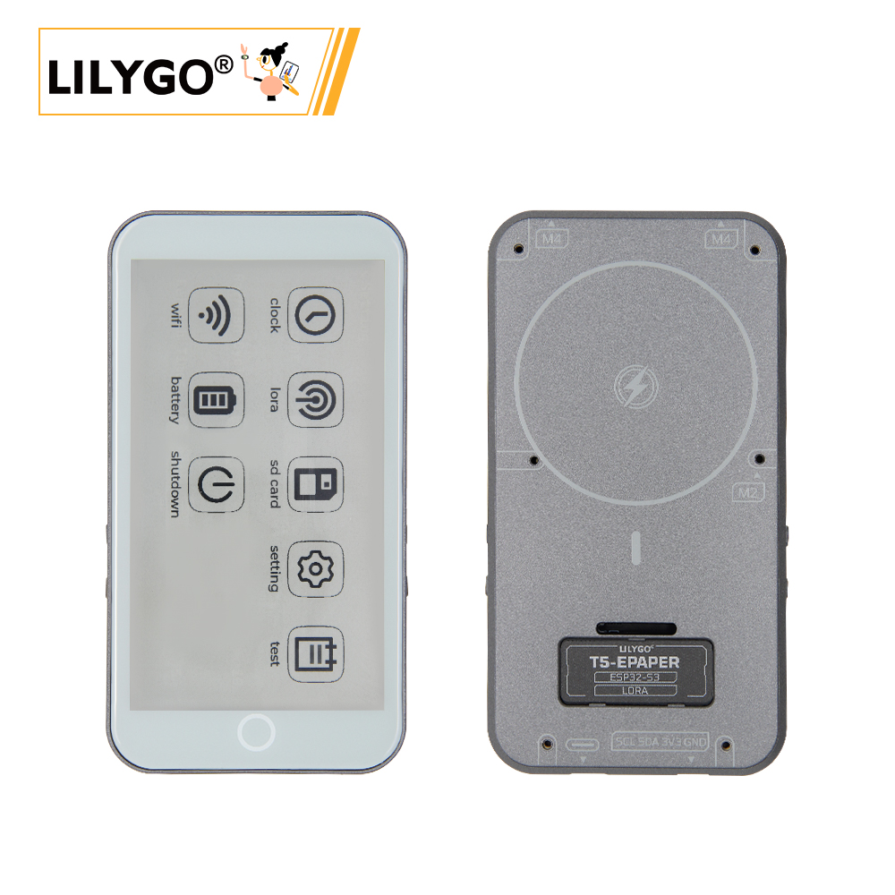
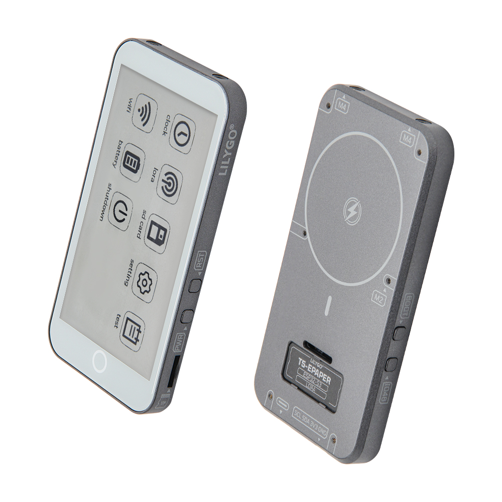
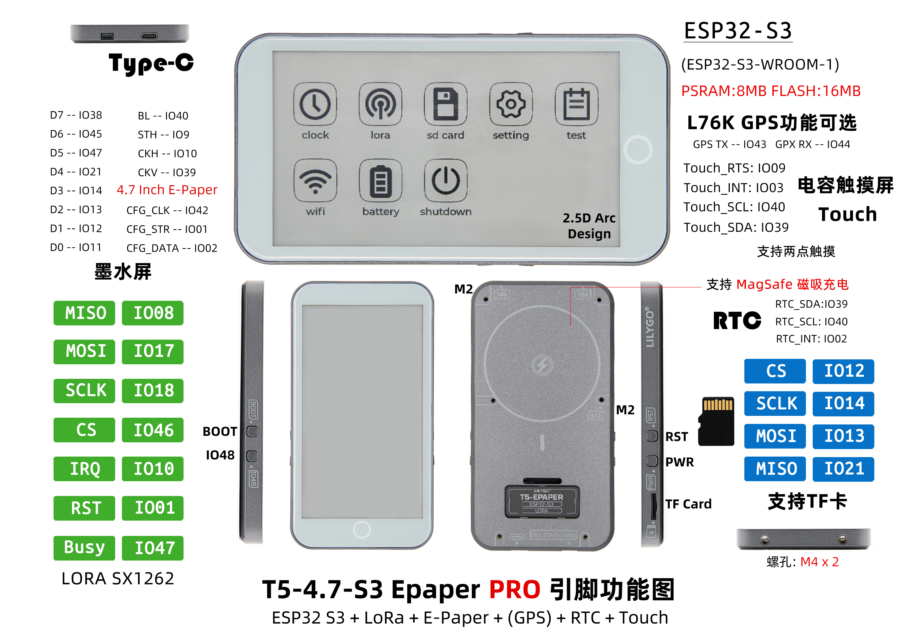

<!-- **[English](README.MD) | 中文** -->

<!-- 

    <a target="_blank" style="margin: 1em;color: white; font-size: 0.9em; border-radius: 0.3em; padding: 0.5em 2em; background-color:rgb(63, 201, 28)" href="https://item.taobao.com/item.htm?id=846226367137">淘宝</a>
    <a target="_blank" style="margin: 1em;color: white; font-size: 0.9em; border-radius: 0.3em; padding: 0.5em 2em; background-color:rgb(63, 201, 28)" href="https://www.aliexpress.com/store/911876460">速卖通</a>

 -->

## Introduction

The T5-4.7-S3 Epaper PRO is a versatile IoT device designed around the ESP32-S3-WROOM-1 main chip (8MB PSRAM + 16MB FLASH). It integrates a LoRa SX1262 long-range communication module, a 4.7-inch E Ink display (low-power, persistent display), and a capacitive touchscreen with two-point touch support.

The device supports expansion with an L76K GPS module (positioning data transmitted via TX/RX pins) and a real-time clock (RTC) module (time synchronization via SDA/SCL pins). It features convenient MagSafe magnetic charging, a built-in TF card slot, and M4 screw holes for mounting or external accessories.

With a variety of interfaces (SPI, UART, etc.), it is compatible with sensors and external devices, making it suitable for applications such as electronic labeling, remote monitoring, and outdoor navigation. It offers low power consumption, high compatibility, and flexible interaction.

## Appearance and function introduction
### Appearance

### Pinmap 

## Module Information and Specifications
### Description

| component | Description |
| ---  | --- |
|MCU	|ESP32-S3-WROOM-1
|Flash 	|16M 
|PSRAM  |8M
|Lora|	SX1262 433Mhz~915Mhz(Optional)
|GPS	|MIA-M10Q
|wireless| 2.4 GHz Wi-Fi& BLE 5
|Storage | TF card |
|Driver IC	|ED047TC1 (4.7 inches, 960x540 , 16 gray)
|Battery capacity |	3.7V-1500mAh
|Battery chip	|BQ25896 (0x6B), BQ27220 (0x55)
|Charge Mode| Magnetic charging(Magsafe) + USB charging
|Touch 	|GT911 (0x5D)
|RTC	|PCF85063 (0x51)
| button| 1 x RST button + 1 x BOOT button + 1 x IO48 button + 1 x PWR button|
|E-link Power Driver	|TPS65185 (0x68)
|IO Extension 	| PCA9535PW (0x20)
| Extended Interface | 2 × QWIIC interface |
| Hole  | M4mm *2  |

### Related Links
Github：[T5 E-paper S3 PRO](https://github.com/Xinyuan-LilyGO/T5S3-4.7-e-paper-PRO)
* [ED047TC1](https://github.com/Xinyuan-LilyGO/T5S3-4.7-e-paper-PRO/blob/H752-01/hardware/ED047TC1.pdf)
* [MIA-M10Q](https://github.com/Xinyuan-LilyGO/T5S3-4.7-e-paper-PRO/blob/H752-01/hardware/MIA-M10Q_DataSheet_UBX-22015849.pdf)
* [TPS65185](https://github.com/Xinyuan-LilyGO/T5S3-4.7-e-paper-PRO/blob/H752-01/hardware/tps65185.pdf)
* [CST226SE](https://github.com/lewisxhe/SensorLib/blob/master/datasheet/%E6%B5%B7%E6%A0%8E%E5%88%9B%E8%A7%A6%E6%91%B8%E8%8A%AF%E7%89%87%E7%A7%BB%E6%A4%8D%E6%89%8B%E5%86%8C-v3.5-20220701(1).pdf)

#### Schematic Diagram

[T5 E-paper S3 PRO](https://github.com/Xinyuan-LilyGO/T5S3-4.7-e-paper-PRO/blob/H752-01/hardware/T5%20E-paper%20S3%20Pro%20V1.0%2024-12-24.pdf)

<!-- * [SY6970](./datasheet/AN_SY6970.pdf) -->

#### Dependency Libraries

* [epdiy](https://github.com/vroland/epdiy)                     
* [RadioLib@6.5.0](https://github.com/jgromes/RadioLib)       
* [XPowersLib@^0.2.3](https://github.com/lewisxhe/XPowersLib)   
* [TinyGPSPlus@^1.1.0](https://github.com/mikalhart/TinyGPSPlus) 
* [SensorLib@0.2.2](https://github.com/lewisxhe/SensorsLib)    
* [lvgl@^8.3.11](https://github.com/lvgl/lvgl/tree/v8.3.11)      

## Software Design
### Arduino Set Parameters

|Arduino IDE Setting	|Value  
| ----------- | -----------|                         
|Board     |	ESP32S3 Dev Module
|Port      |    Your port                        
|USB CDC On Boot	|Enable
|CPU Frequency	|240MHZ(WiFi)                      
|Core Debug Level	|None                              
|USB DFU On Boot	|Disable                          
|Erase All Flash Before Sketch Upload	|Disable                          
|Events Run On	|Core1                            
|Flash Mode	QIO |80MHZ                        
|Flash Size	|16MB(128Mb)                  
|Arduino Runs On	|Core1                            
|USB Firmware MSC On Boot	|Disable                          
|Partition Scheme	|16M Flash(3M APP/9.9MB FATFS)
|PSRAM	|OPI PSRAM                    
|Upload Mode	|UART0/Hardware CDC            
|Upload Speed	|921600                            
|USB Mode	|CDC and JTAG      

### Development Platform
1. [VS Code](https://code.visualstudio.com/)
2. [Arduino IDE](https://www.arduino.cc/en/software)

## Product Technical Support 

