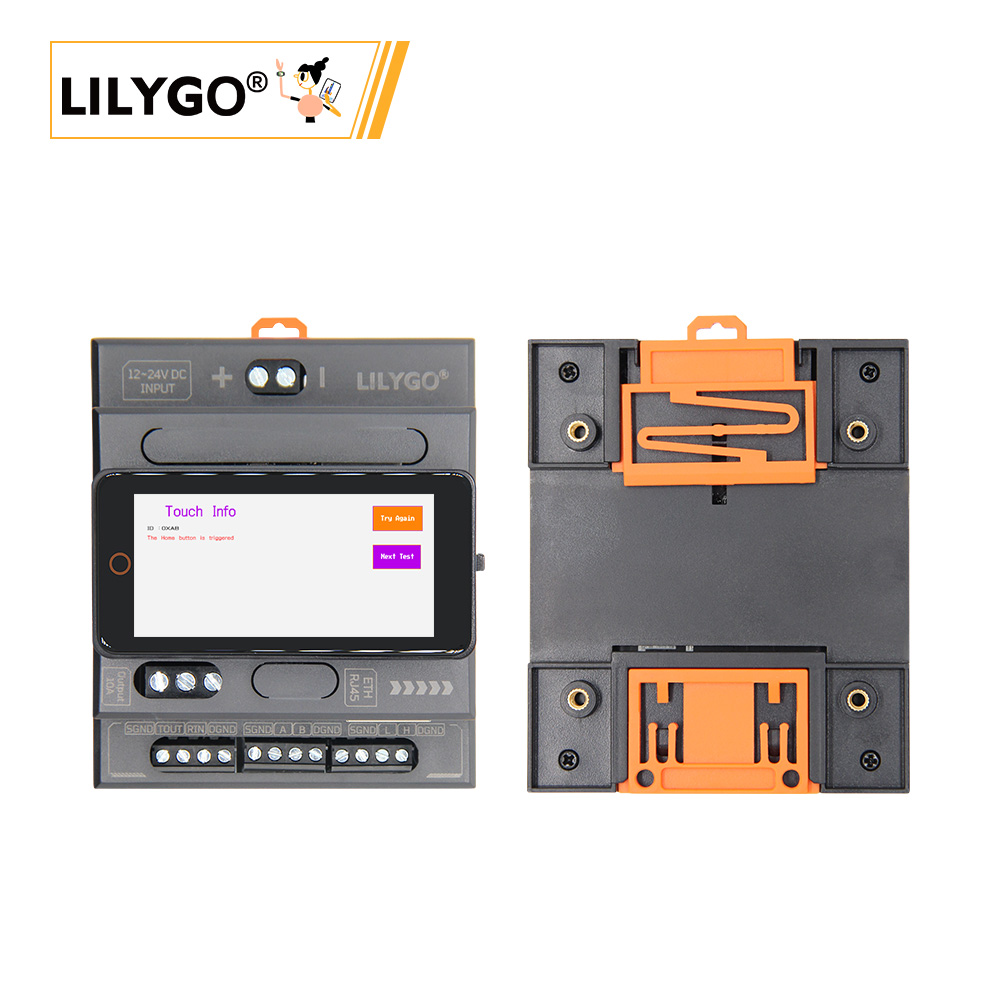
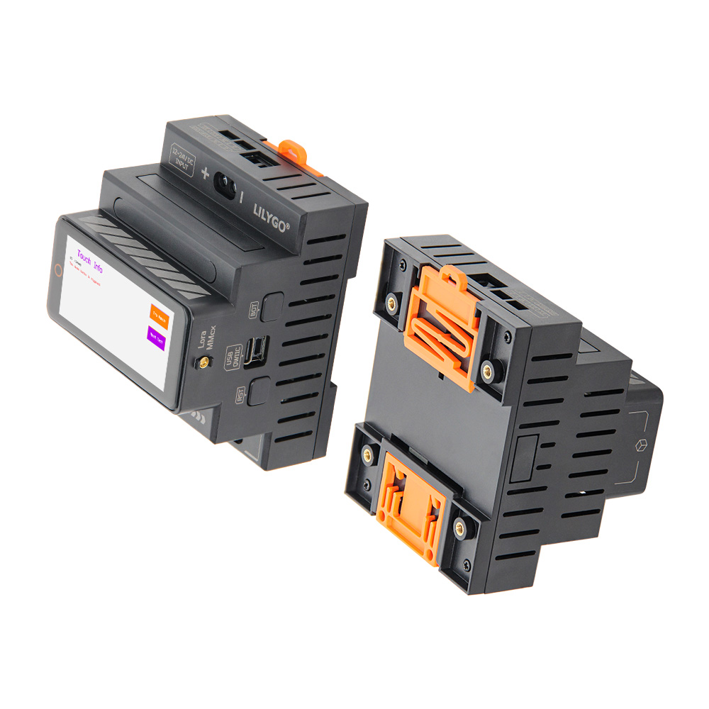
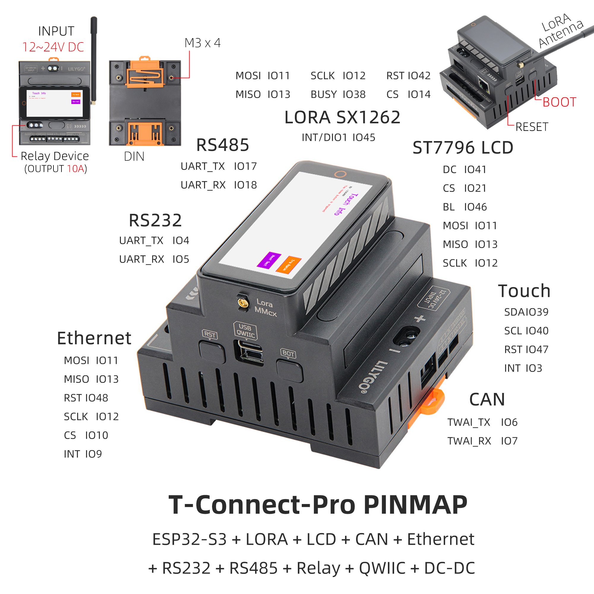

<!-- **[English](README.MD) | 中文** -->

## Introduction

T-Connect-Pro 是一款基于 ESP32-S3 的多功能工业级控制与通信模块，集成 LoRa（SX1262 芯片）、ST7796 LCD 显示屏（分辨率及引脚 DC/CS/BL）、CAN总线、以太网接口及双串口（RS232/RS485），支持 12~24V 宽电压输入与 10A 继电器输出，适用于复杂工业自动化与物联网场景。其硬件配置涵盖 触摸功能（SDA/SCL/RST）、SPI 网口通信（MOSI/MISO/SCLK）、QWIIC 扩展接口及 DC-DC 电源管理，提供多协议通信（LoRa 远距离传输、CAN 总线控制）、实时数据显示（LCD）及设备联动控制（继电器）能力，可灵活适配智能工厂、远程传感、能源监控等领域的多样化需求，兼具高兼容性与稳定性

## Appearance and function introduction
### Appearance

### Pinmap 

## Module Information and Specifications
### Description

The T-Connect-Pro is based on the ESP32S3 main control chip and consists of a three-layer stacked board design. It offers a wide range of features and integrates three different communication modules—CAN, RS485, and RS232—for long-distance transmission. Additionally, it includes an Ethernet interface, a relay interface, an LoRa module (SX1262), and an LCD screen for more convenient operation.

| component | Description |
| --- | --- |
| MCU | ESP32-S3-R8
| FLASH| 16MB |
| PS RAM | 8MB|
| Axis sensor | BMA423 (IIC)|
| Ethernet | W5500 (SPI) |
| LoRa | HPD16A SX1262 chips support the frequency band from 433 to 920HMZ(optional) |
| CAN | TD501MCANFD (TWAI) |
| RS485 | TD501D485H-A (UART)|
| RS232 | TD501D232H (UART)|
| Relay | output 10A|
| Power management | AXP2101 Highly integrated power management unit |
| USB | 1 x USB Port and OTG(TYPE-C port) |
| Extended interface | 1 x QWIIC interface |
| Button | 1 x RESET button + 1 x BOOT button (built-in) |
| Screen | ST7796 TFT screen 222x480px(SPI)|
| Touch | CST226SE (IIC)|
| Power supply | 5V/500mA |
| Hole | **M3mm screw hole x 4** |
| Dimensions | ** 88x72x60mm with base ** |

### Related Links

Github:[T-Connect-Pro](https://github.com/Xinyuan-LilyGO/T-Connect-Pro)

- [Espressif ESP32-S3 Datasheet](https://www.espressif.com.cn/sites/default/files/documentation/esp32-s3_datasheet_en.pdf)
- [HPD16A_V1.1](https://github.com/Xinyuan-LilyGO/T-Connect-Pro/blob/main/information/HPDTEK_HPD16A_TCXO_V1.1.pdf)
- [SX1262_V2.1](https://github.com/Xinyuan-LilyGO/T-Connect-Pro/blob/main/information/DS_SX1261-2_V2_1.pdf)
- [TD501MCANFD](https://github.com/Xinyuan-LilyGO/T-Connect-Pro/blob/main/information/TD501MCANFD_MORNSUN.pdf)
- [TD501D485H-A](https://github.com/Xinyuan-LilyGO/T-Connect-Pro/blob/main/information/TD501D485H-A_K-CUT.pdf)
- [TD501D232H](https://github.com/Xinyuan-LilyGO/T-Connect-Pro/blob/main/information/TD501D232H.pdf)

#### Schematic Diagram
[T-Connect-Pro](https://github.com/Xinyuan-LilyGO/T-Connect-Pro/blob/main/project/T-Connect-Pro_V1.0.pdf)

#### Dependency Libraries
- 触摸: [Arduino_DriveBus-1.1.2](https://github.com/Xk-w/Arduino_DriveBus)
- LoRa: [RadioLib-6.6.0](https://github.com/jgromes/RadioLib)
- 屏幕:[Arduino_GFX](https://github.com/moononournation/Arduino_GFX)
- 以太网:[Ethernet_V2.0.0](http://www.arduino.cc/en/Reference/Ethernet)

## Software Design
### Arduino Set Parameters

|Setting|	Value|
| :--------------: | :------------: |
|Board	| ESP32S3 Dev Module
|Upload Speed	|921600
|USB Mode	|Hardware CDC and JTAG
|USB CDC On Boot	|Enabled
|USB Firmware MSC On Boot	|Disabled
|USB DFU On Boot|	Disabled
|CPU Frequency	|240MHz (WiFi)
|Flash Mode	|QIO 80MHz
|Flash Size	|16MB (128Mb)
|Core Debug Level|	None
|Partition Scheme	|16M Flash (3MB APP/9.9MB FATFS)
|PSRAM	|OPI PSRAM
|Arduino Runs On	|Core 1
|Events Run On	|Core 1
### Development Platform
1. [VS Code](https://code.visualstudio.com/)
2. [Arduino IDE](https://www.arduino.cc/en/software)

## Product Technical Support 

