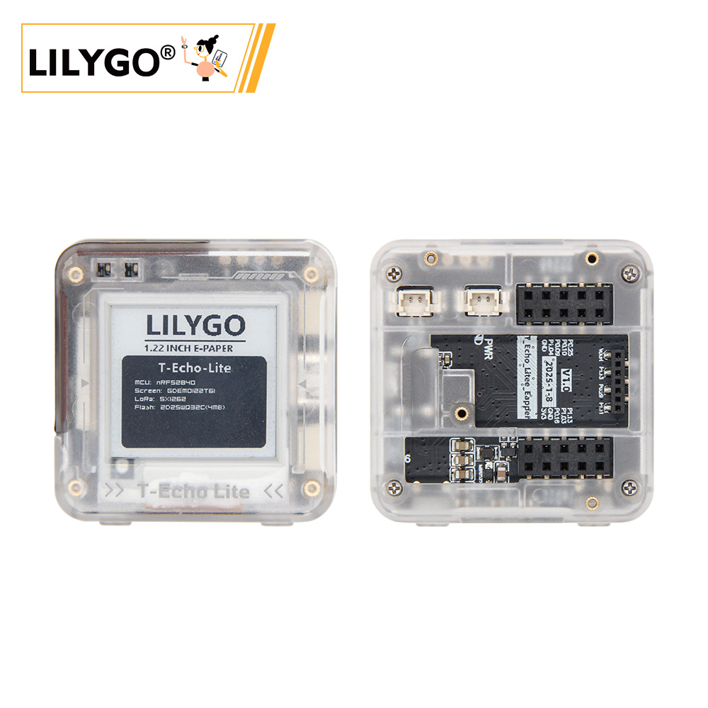
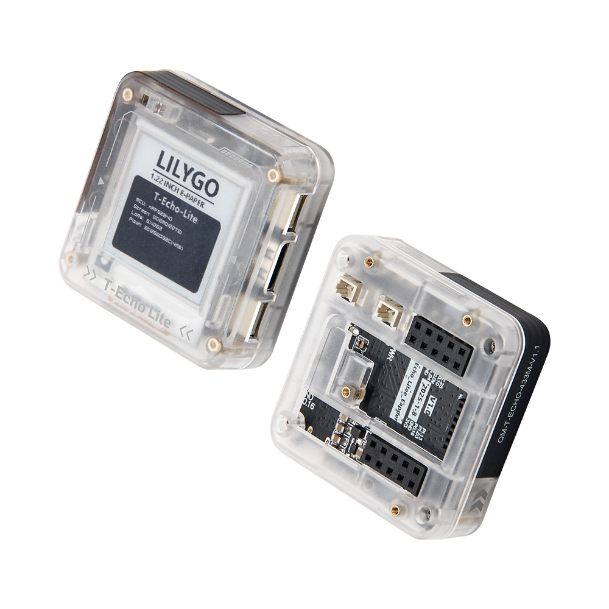
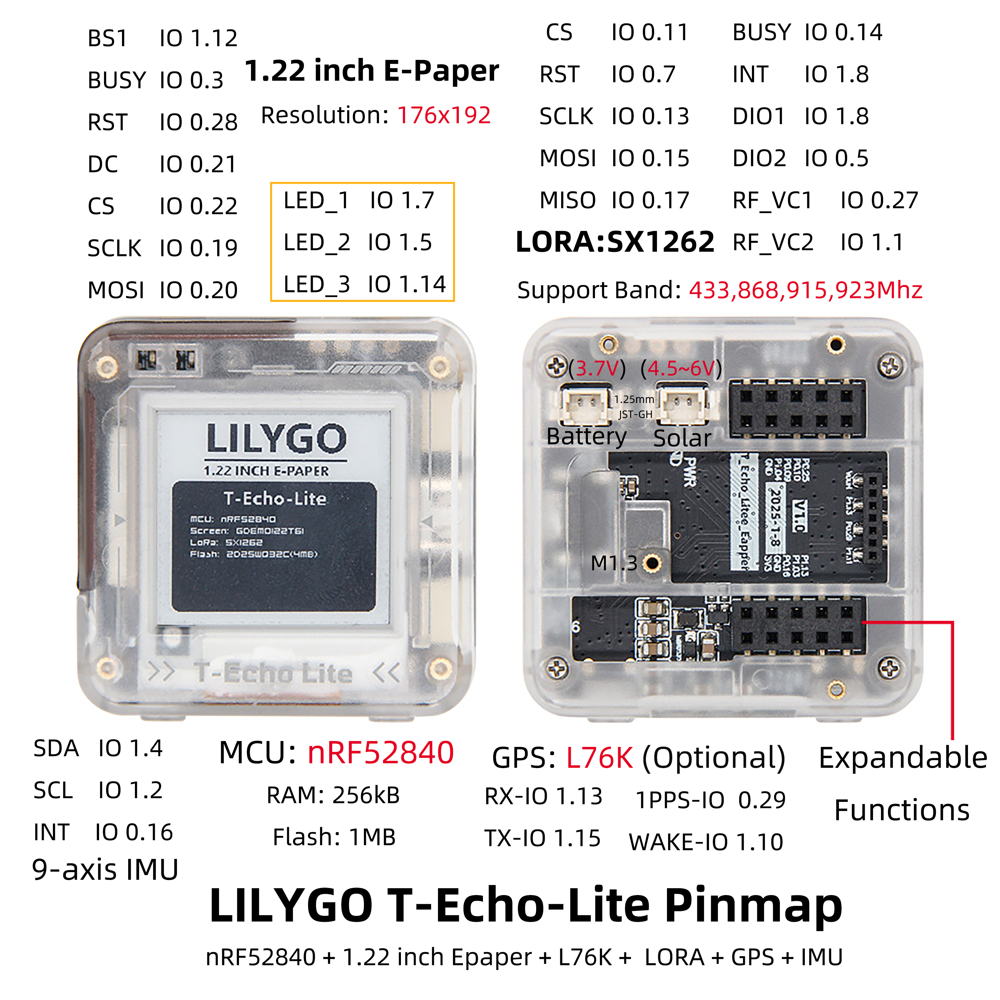

<!-- **[English](README.MD) | 中文** -->

<!-- 

    <a target="_blank" style="margin: 1em;color: white; font-size: 0.9em; border-radius: 0.3em; padding: 0.5em 2em; background-color:rgb(63, 201, 28)" href="https://item.taobao.com/item.htm?id=846226367137">淘宝</a>
    <a target="_blank" style="margin: 1em;color: white; font-size: 0.9em; border-radius: 0.3em; padding: 0.5em 2em; background-color:rgb(63, 201, 28)" href="https://www.aliexpress.com/store/911876460">速卖通</a>

 -->

## Introduction

T-Echo Lite is a Lite version of T-Echo. The LoRa + NRF52840 + e-paper combination has been verified as the lowest power consumption solution available, making it suitable for use as a LoRa node with Meshtastic firmware.

T-Echo Lite comes in three versions:
- T-Echo Lite Core
- T-Echo Lite Base
- T-Echo Lite (Main Unit)

T-Echo Lite (Main Unit)
The main unit is designed based on the T-Echo Lite Base, integrating a 1.2-inch e-paper screen and an enclosure. It also supports an optional GPS expansion module.

The Core module integrates NRF52840, LoRa, solar power support, and battery charging/discharging circuits. It features a compact stamp hole design, making it easy to embed into various user applications.。
T-Echo Lite Base
The Base is an expansion board built around the Core module. It extends the functionality of the Core module to include:
- Battery connector
- Solar panel connector
- QWIIC and USB interfaces
- 1.22-inch e-paper screen interface
- Optional GPS expansion module

## Appearance and function introduction
### Appearance

### Pinmap 

## Module Information and Specifications
### Description

T-Echo Lite is a lightweight version of T-Echo, featuring a smaller size and lower power consumption;
The deep sleep power consumption can reach as low as 2μA–10μA (actual power consumption may vary depending on onboard components;
the minimum power consumption value is based on LILYGO laboratory test results on an engineering board).
T-Echo Lite comes with rich onboard features, including:

- Inertial sensor
- LoRa module
- Solar charging function (5V)
- External GPS support

With its excellent power efficiency, T-Echo Lite offers exceptional battery life, making it ideal for low-power applications.
<table role="table" class="center_table">
  <thead>
    <tr>
      <th colspan = "2">MCU</th>
    </tr>
  </thead>
  <tr>
    <td>Chip</td>
    <td>nRF52840</td>
  </tr>
  <tr>
    <td>RAM</td>
    <td>256kB</td>
  </tr>
</table>

<table role="table" class="center_table">
  <thead>
    <tr>
      <th colspan = "2">Screen</th>
    </tr>
  </thead>
  <tr>
    <td>Name</td>
    <td>GDEM0122T61</td>
  </tr>
  <tr>
    <td>Size</td>
    <td>1.22 英寸</td>
  </tr>
    <tr>
    <td>Resolution</td>
    <td>176x192px</td>
  </tr>
    <tr>
    <td>Screen type</td>
    <td>E-PAPER</td>
  </tr>
    <tr>
    <td>Driver Chip</td>
    <td>SSD1681</td>
  </tr>
    <tr>
    <td>Communication Protocol</td>
    <td>IIC</td>
  </tr>
</table>

<table role="table" class="center_table">
  <thead>
    <tr>
      <th colspan = "2">LORA</th>
    </tr>
  </thead>
  <tr>
    <td>Chip Module</td>
    <td>S62F</td>
  </tr>
  <tr>
    <td>Chip</td>
    <td>SX1262</td>
  </tr>
    <tr>
    <td>Communication Protocol</td>
    <td>SPI</td>
  </tr>
</table>

<table role="table" class="center_table">
  <thead>
    <tr>
      <th colspan = "2">GPS</th>
    </tr>
  </thead>
  <tr>
    <td>Chip</td>
    <td>L76K</td>
  </tr>
    <tr>
    <td>Communication Protocol</td>
    <td>UART</td>
  </tr>
</table>

<table role="table" class="center_table">
  <thead>
    <tr>
      <th colspan = "2">Inertial Sensor</th>
    </tr>
  </thead>
  <tr>
    <td>Chip</td>
    <td>ICM20948</td>
  </tr>
    <tr>
    <td>Communication Protocol</td>
    <td>IIC</td>
  </tr>
</table>

<table role="table" class="center_table">
  <thead>
    <tr>
      <th colspan = "2">Flash</th>
    </tr>
  </thead>
  <tr>
    <td>Chip</td>
    <td>ZD25WQ32CEIGR</td>
  </tr>
    <tr>
    <td>Communication Protocol</td>
    <td>SPI</td>
  </tr>
</table>
<!-- | IMU | **板载六轴 IMU 传感器（三轴加速度+三轴角速度）** | -->
<!-- | RTC | **板载 BM8653 RTC 芯片+纽扣电池，断电时间仍然正确** | -->

### Related Links

Github:[T-Echo-Lite](https://github.com/Xinyuan-LilyGO/T-Echo-Lite)

- [nRF52840_Datasheet](https://docs.nordicsemi.com/bundle/ps_nrf52840/page/keyfeatures_html5.html)
- [GDEM0122T61](https://github.com/Xinyuan-LilyGO/T-Echo-Lite/blob/main/information/GDEM0122T61.pdf)
- [SSD1681](https://github.com/Xinyuan-LilyGO/T-Echo-Lite/blob/main/information/SSD1681.pdf)
- [S62F](https://github.com/Xinyuan-LilyGO/T-Echo-Lite/blob/main/information/S62F.pdf)
- [L76KB-A58](https://github.com/Xinyuan-LilyGO/T-Echo-Lite/blob/main/information/L76KB-A58.pdf)
- [ICM20948](https://github.com/Xinyuan-LilyGO/T-Echo-Lite/blob/main/information/ICM20948.pdf)
- [ZD25WQ32CEIGR](https://github.com/Xinyuan-LilyGO/T-Echo-Lite/blob/main/information/ZD25WQ32CEIGR.pdf)

#### Schematic Diagram
- [T-Echo-Lite](https://github.com/Xinyuan-LilyGO/T-Echo-Lite/blob/main/project/T-Echo-Lite_V1.0/T-Echo-Lite-Eapper_V1.0.pdf)

#### Dependency Libraries
- [Adafruit_EPD-4.5.5](https://github.com/Xinyuan-LilyGO/T-Echo-Lite/tree/main/libraries/Adafruit_EPD-4.5.5)
- [Adafruit_BusIO-1.16.1](https://github.com/Xinyuan-LilyGO/T-Echo-Lite/tree/main/libraries/Adafruit_BusIO-1.16.1)
- [Adafruit_SPIFlash-4.3.4](https://github.com/Xinyuan-LilyGO/T-Echo-Lite/tree/main/libraries/Adafruit_SPIFlash-4.3.4)
- [Adafruit-GFX-Library-1.11.10](https://github.com/Xinyuan-LilyGO/T-Echo-Lite/tree/main/libraries/Adafruit-GFX-Library-1.11.10)
- [RadioLib-6.6.0](https://github.com/Xinyuan-LilyGO/T-Echo-Lite/tree/main/libraries/RadioLib-6.6.0)
- [TinyGPSPlus-1.0.3a](https://github.com/Xinyuan-LilyGO/T-Echo-Lite/tree/main/libraries/TinyGPSPlus-1.0.3a)
- [ICM20948_WE-1.1.11](https://github.com/Xinyuan-LilyGO/T-Echo-Lite/tree/main/libraries/ICM20948_WE-1.1.11)

## Software Design
### Arduino Set Parameters

| Setting                               | Value                                 |
| :-------------------------------: | :-------------------------------: |
| Board                                 | Nordic nRF52840 DK           |

Please refer to the instructions for use[README](https://github.com/Xinyuan-LilyGO/T-Echo-Lite/blob/main/README_CN.md)
### Development Platform
1. [C](https://github.com/Xk-w/Arduino_DriveBus)
2. [Arduino IDE](https://www.arduino.cc/en/software)
3. [Platform IO](https://github.com/Xk-w/Arduino_DriveBus)

## Product Technical Support 

