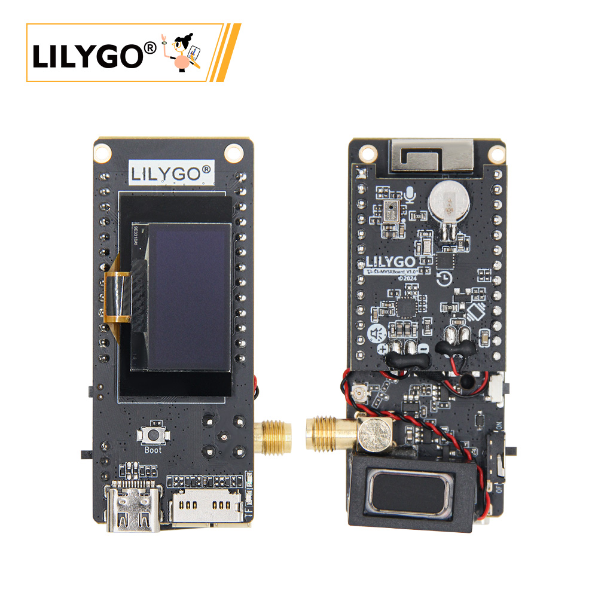
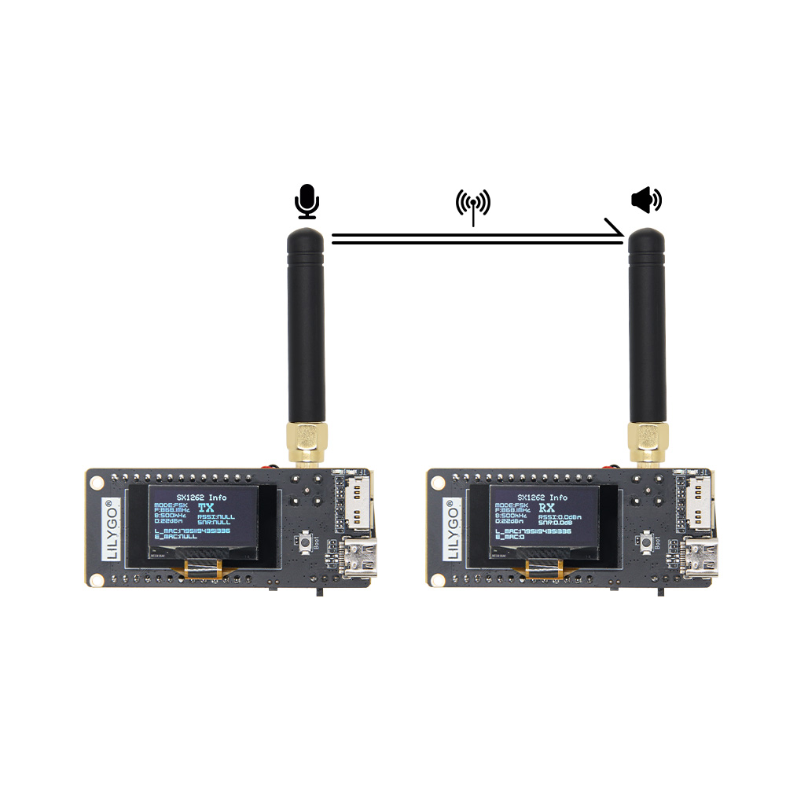
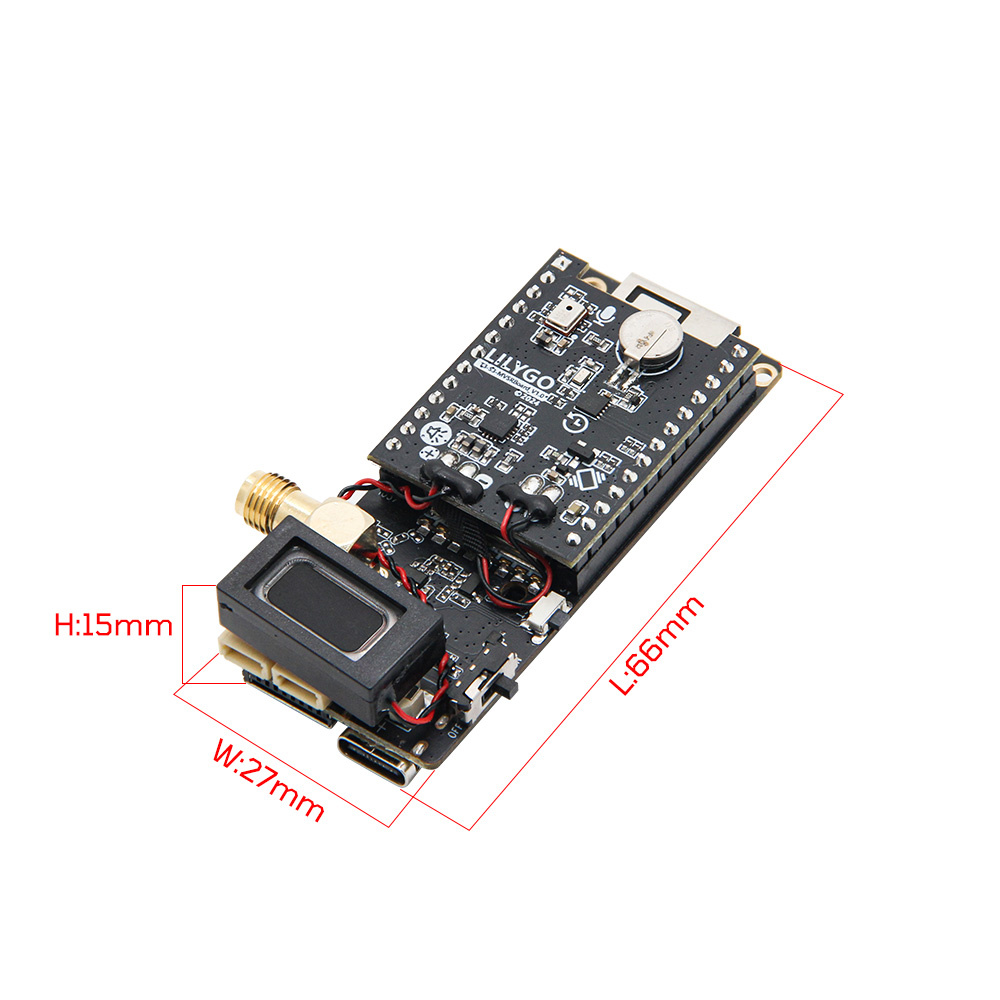
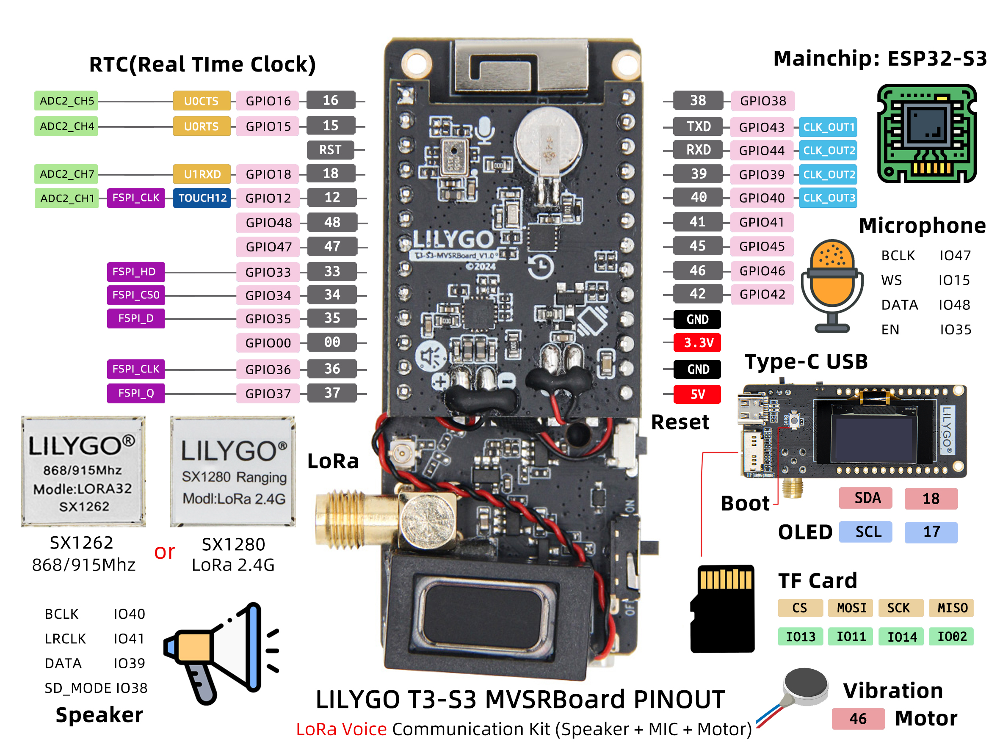

<!-- **[English](README.MD) | 中文** -->

<!-- 

    <a target="_blank" style="margin: 1em;color: white; font-size: 0.9em; border-radius: 0.3em; padding: 0.5em 2em; background-color:rgb(63, 201, 28)" href="https://item.taobao.com/item.htm?id=846226367137">淘宝</a>
    <a target="_blank" style="margin: 1em;color: white; font-size: 0.9em; border-radius: 0.3em; padding: 0.5em 2em; background-color:rgb(63, 201, 28)" href="https://www.aliexpress.com/store/911876460">速卖通</a>

 -->

## Introduction

The T3-S3 MVSR version is an extended version of the T3-S3 mainboard, featuring a vibration motor, microphone, speaker, and RTC module. Its primary application is for LoRa voice transmission and reception.

This expansion version currently supports two T3-S3 mainboard models: SX1262 and SX1280.

The SX1262 version uses the FSK modulation scheme.

The SX1280 version uses the LoRa modulation scheme.

A corresponding test demo is available on GitHub for development reference. Additionally, this expansion version can be used for AI voice interaction, MP3 playback, and other applications.

## Appearance and function introduction
### Appearance

### Pinmap 

## Module Information and Specifications
### Description

The T3-S3-MVSRBoard is a backplane design for the T3-S3_V1.2 motherboard, with onboard speaker and microphone expansion functions, and very low static current. In addition, it includes vibration and RTC (Real-time clock) functions

<table role="table" class="center_table">
  <thead>
    <tr>
      <th colspan = "2">Speak</th>
    </tr>
  </thead>
  <tr>
    <td>Chip</td>
    <td>MAX98357A</td>
  </tr>
  <tr>
    <td>Communication Protocol</td>
    <td>IIS</td>
  </tr>
</table>

<table role="table" class="center_table">
  <thead>
    <tr>
      <th colspan = "2">Microphone</th>
    </tr>
  </thead>
  <tr>
    <td>Chip</td>
    <td>MSM261S4030H0R</td>
  </tr>
  <tr>
    <td>Communication Protocol</td>
    <td>PDM</td>
  </tr>
</table>

<table role="table" class="center_table">
  <thead>
    <tr>
      <th colspan = "2">RTC</th>
    </tr>
  </thead>
  <tr>
    <td>Chip</td>
    <td>PCF85063ATL</td>
  </tr>
  <tr>
    <td>Communication Protocol</td>
    <td>IIC</td>
  </tr>
</table>
<!-- | IMU | **板载六轴 IMU 传感器（三轴加速度+三轴角速度）** | -->
<!-- | RTC | **板载 BM8653 RTC Chip+纽扣电池，断电时间仍然正确** | -->

### Related Links

Github:[T3-S3-MBSRBoard](https://github.com/Xinyuan-LilyGO/T3-S3-MVSRBoard)

- [MAX98357A](https://github.com/Xinyuan-LilyGO/T3-S3-MVSRBoard/blob/main/information/MAX98357AETE+T.pdf)
- [MSM261S4030H0R](https://github.com/Xinyuan-LilyGO/T3-S3-MVSRBoard/blob/main/information/MEMSensing-MSM261S4030H0R.pdf)
- [PCF85063ATL](https://github.com/Xinyuan-LilyGO/T3-S3-MVSRBoard/blob/main/information/PCF85063ATL-1,118.pdf)
- [MP34DT05-A](https://github.com/Xinyuan-LilyGO/T3-S3-MVSRBoard/blob/main/information/mp34dt05-a.pdf)

#### Schematic Diagram

[T3-S3-MVSRBoard](https://github.com/Xinyuan-LilyGO/T3-S3-MVSRBoard/blob/main/project/T3-S3-MVSRBoard_V1.0.pdf)

#### Dependency Libraries
- [Speak](https://github.com/Xk-w/Arduino_DriveBus)
- [Microphone](https://github.com/Xk-w/Arduino_DriveBus)
- [RTC](https://github.com/Xk-w/Arduino_DriveBus)

## Software Design
### Arduino Set Parameters

| Setting                               | Value                                 |
| :-------------------------------: | :-------------------------------: |
| Board                                 | ESP32S3 Dev Module           |
| Upload Speed                     | 921600                               |
| USB Mode                           | Hardware CDC and JTAG     |
| USB CDC On Boot                | Enabled                              |
| USB Firmware MSC On Boot | Disabled                             |
| USB DFU On Boot                | Disabled                             |
| CPU Frequency                   | 240MHz (WiFi)                    |
| Flash Mode                         | QIO 80MHz                         |
| Flash Size                           | 16MB (128Mb)                    |
| Core Debug Level                | None                                 |
| Partition Scheme                | 16M Flash (3MB APP/9.9MB FATFS) |
| PSRAM                                | OPI PSRAM                         |
| Arduino Runs On                  | Core 1                               |
| Events Run On                     | Core 1                               |           

### Development Platform
1. [C](https://github.com/Xk-w/Arduino_DriveBus)
2. [Arduino IDE](https://www.arduino.cc/en/software)
3. [Platform IO](https://github.com/Xk-w/Arduino_DriveBus)

## Product Technical Support 

