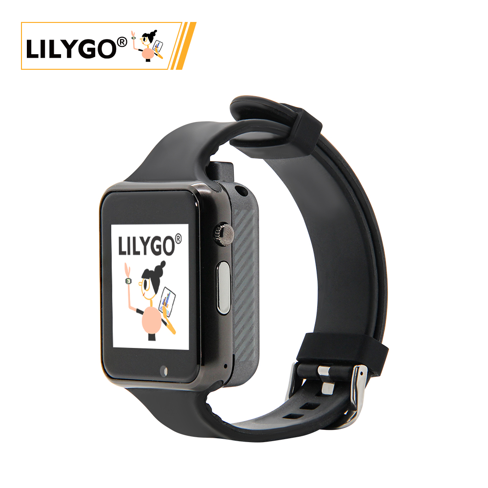
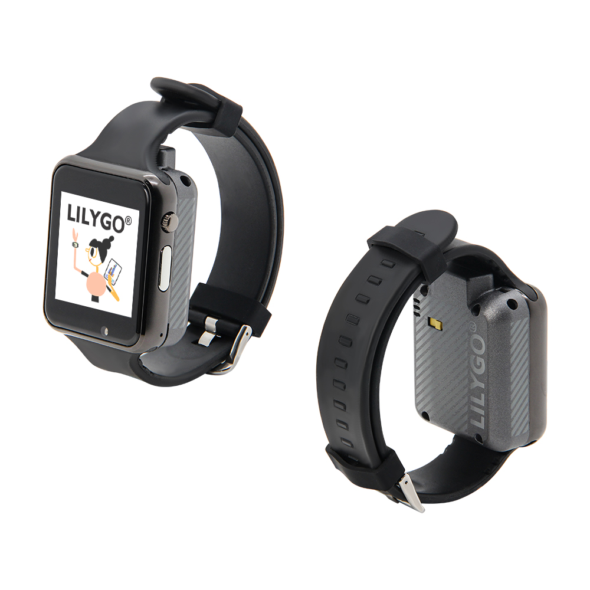
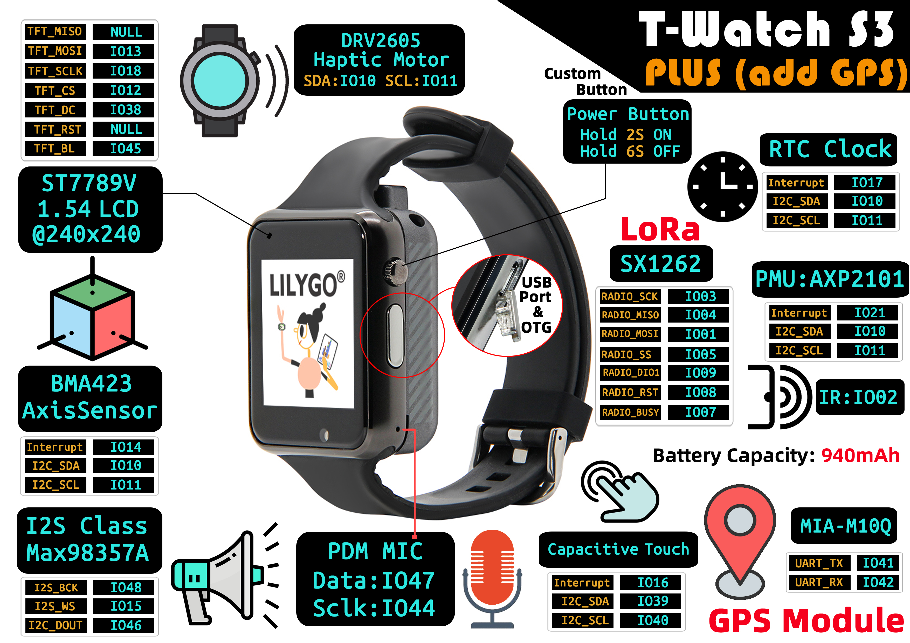

<!-- 

    <a target="_blank" style="margin: 1em;color: white; font-size: 0.9em; border-radius: 0.3em; padding: 0.5em 2em; background-color:rgb(63, 201, 28)" href="https://item.taobao.com/item.htm?id=846226367137">淘宝</a>
    <a target="_blank" style="margin: 1em;color: white; font-size: 0.9em; border-radius: 0.3em; padding: 0.5em 2em; background-color:rgb(63, 201, 28)" href="https://www.aliexpress.com/store/911876460">速卖通</a>

 -->

## Introduction

The T-Watch S3 Plus version builds upon the T-Watch S3 by adding GPS functionality. Like the T-Watch S3, it is a multifunctional smart wearable device that integrates high-performance hardware and wireless communication technology, making it suitable for sports health monitoring, remote interaction, and audio applications.

Its core specifications include a 1.54-inch 240x240 HD LCD display, a BMA423 motion sensor, and a capacitive touch module for precise motion tracking and responsive touch operations. It also features a Max98357A audio amplifier and a PDM microphone, enabling high-quality audio output and voice command input.

Currently, the T-Watch S3 Plus is available in two versions: 1262 and 1280. It incorporates an RFC clock module, facilitating long-range, low-power wireless communication, making it ideal for IoT and industrial sensing applications.

With its compact design and integration of motion tracking, voice interaction, and remote communication, the T-Watch S3 Plus is well-suited for diverse applications such as outdoor adventures, health monitoring, and smart home control, combining both technological sophistication and practicality.

## Appearance and function introduction
### Appearance

### Pinmap 

## Module Information and Specifications
### Description

The T-Watch S3 Plus meets the needs of developers who want to experiment with LoRa and ESP32 S3 technology in wearable devices. It is highly customizable and suitable for various applications.

| Component | Description |
| --- | --- |
| MCU | ESP32-S3 |
| FLASH| 16MB |
| PS RAM | 8MB|
| RTC | 8MB|
| Axis Sensor | BMA423 (IIC)|
| Wireless | Wi-Fi: 802.11 b/g/n; BLE V5.0 |
| LoRa | SX1262，SX1280 frequency bands:433~915HMZ(optional) |
| Haptic Motor | DRV2605  (IIC)|
| PMU | AXP2101 Highly integrated power management unit |
| USB | 1 × USB Port and OTG(micro) |
| button | 1 x POWER button (hold down for 2 seconds to power on, hold down for 6 seconds to power off) + 1 x BOOT button (built-in) |
| Audio Output | Max98357A(IIC) |
| Audio Input | PDM MIC |
| Display | 1.5inch LCD Screen 240 × 240(SPI)|
| Touch | capacitive touch screen (IIC)|
| Power | 5V/500mA input|
| Dimensions | **No strap 51.5x42x20mm**  |
### Related Links

Github:[T-Watch S3 Plus](https://github.com/Xinyuan-LilyGO/TTGO_TWatch_Library/)

#### Schematic Diagram

[T-Watch S3 Plus](https://github.com/Xinyuan-LilyGO/TTGO_TWatch_Library/blob/t-watch-s3/schematic/T_WATCH_S3.pdf)

#### Dependency Libraries
- [TTGO_TWatch_Library](https://github.com/Xinyuan-LilyGO/TTGO_TWatch_Library/tree/t-watch-s3)

## Software Design
### Arduino Set Parameters

| Setting                               | Value                                 |
| :-------------------------------: | :-------------------------------: |
| Board                                 | ESP32S3 Dev Module           |
| Upload Speed                     | 921600                               |
| USB Mode                           | UART0/Hardware CDC     |
| USB CDC On Boot                | Enabled                              |
| USB Firmware MSC On Boot | Disabled                             |
| USB DFU On Boot                | Disabled                             |
| CPU Frequency                   | 240MHz (WiFi)                    |
| Flash Mode                         | QIO 80MHz                         |
| Flash Size                           | 16MB (128Mb)                    |
| Core Debug Level                | None                                 |
| Partition Scheme                | 16M Flash (3MB APP/9.9MB FATFS) |
| PSRAM                                | OPI PSRAM        |
| Arduino Runs On                  | Core 1                               |
| Events Run On                     | Core 1         |           

### Development Platform

1. [ESP-IDF](https://www.espressif.com/zh-hans/products/sdks/esp-idf)
2. [Arduino IDE](https://www.arduino.cc/en/software)
3. [VS Code](https://code.visualstudio.com/)
4. [Micropython](https://micropython.org/)

## Product Technical Support 

