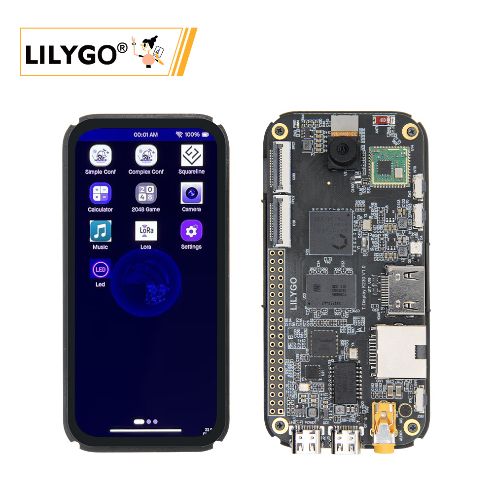
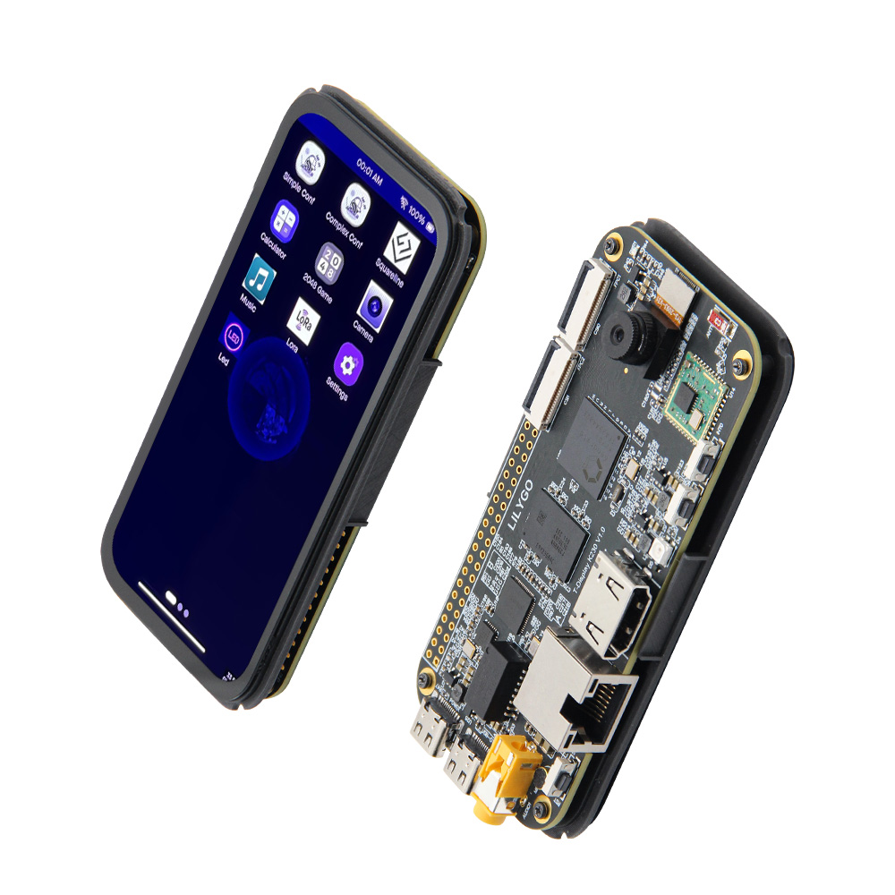
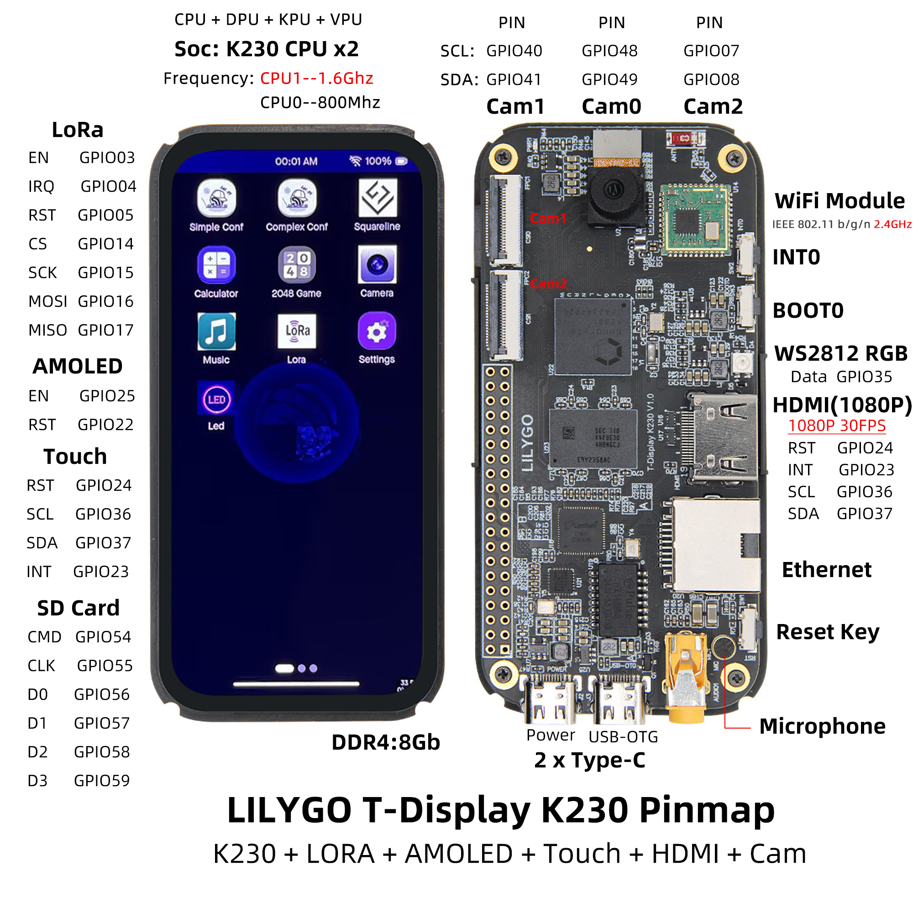

<!-- **[English](README.MD) | 中文** -->

<!-- 

    <a target="_blank" style="margin: 1em;color: white; font-size: 0.9em; border-radius: 0.3em; padding: 0.5em 2em; background-color:rgb(63, 201, 28)" href="https://item.taobao.com/item.htm?id=846226367137">淘宝</a>
    <a target="_blank" style="margin: 1em;color: white; font-size: 0.9em; border-radius: 0.3em; padding: 0.5em 2em; background-color:rgb(63, 201, 28)" href="https://www.aliexpress.com/store/911876460">速卖通</a>

 -->

## 概述

T-Display K230 是继 K210 之后，基于嘉楠科技最新芯片 K230 设计的一款全新产品。它继承了 K230 高达 1.6GHz 主频的强大算力，并融合了 LILYGO 特色的 LoRa 通讯功能和Display，同时集成了HDMI接口和以太网接口，为开发者提供更广泛的应用可能。

在外观设计上，T-Display K230采用了符合手持设备尺寸的设计，配备4.1英寸优质AMOLED屏幕，支持电容触摸，提供更加流畅的视觉体验和交互体验。同时，我们提供了屏幕UI Demo应用演示，方便开发者快速上手。

K230作为一款AIoT领域的高性能芯片，具备丰富的计算能力和扩展接口：

双核RISC-V处理器主频高达1.6GHz，提供强大算力

集成NPU（神经网络处理单元），算力接近1.6TOPS，支持AI推理加速

内置ISP（图像信号处理器）优化摄像头图像处理效果，优化摄像头图像处理效果

支持H.264编码可​，可用于视频流处理和边缘计算

另外，LoRa通讯+ISP摄像头的组合，让T-Display K230在远程、无线数据传输、AI识别、物联网监控交互等领域都具备强大优势。欢迎加入我们，共同探索更多LoRa与AIoT的无限可能！

## 外观及功能介绍
### 外观

### 引脚图 

<!-- | 
Arduino IDE Setting  
 | 
Value
 |
|   :----------------------------------------------- | :------------------------------------------------ |
| Board                                    | **ESP32S3 Dev Module**
| Port                                     |Your port         
| USB CDC On Boot                          |Enable 
| CPU Frequency                            |240MHZ(WiFi)    
| Core Debug Level                         |None       
| USB DFU On Boot                          |disable            
| Erase All Flash Before Sketch Upload     |disable   
| Events Run On                            |Your port         
| Flash Mode                               |Enable 
| Flash Size                               |240MHZ(WiFi)    
| Arduino Runs On                          |None 
| USB Firmware MSC On Boot                 |disable            
| Partition Scheme                         |disable   
| PSRAM                                    |240MHZ(WiFi)    
| Upload Mode                              |None 
| Upload Speed                             |disable            
| USB Mode                                 |CDC and JTAG    -->

## 模块资料以及参数

<table role="table" class="center_table">
  <thead>
    <tr>
      <th colspan = "2">ESP32模块</th>
    </tr>
  </thead>
    <tr>
    <td>芯片</td>
    <td>ESP32-S3-R8</td>
  </tr>
  <tr>
    <td>PSRAM</td>
    <td>8M</td>
  </tr>
  <tr>
    <td>FLASH</td>
    <td>16M</td>
  </tr>
</table>

| 组件 | 描述 |
| --- | --- |
| CPU 大核 | 1.6GHz RISC-V 32KB I-cache, 32KB D-cache, 256KB L2 Cache，128bit RVV 1.0扩展 |
| CPU 小核 | 0.8GHz RISC-V 32KB I-cache, 32KB D-cache, 128KB L2 Cache |
| KPU | 支持 INT8 和 INT16  典型网络性能：Resnet 50 ≥ 85fps @INT8 ；Mobilenet_v2 ≥ 670fps @INT8；YoloV5S ≥ 38fps @INT8|
| 内存 | 8Gb LPDDR4  |
| 存储 | TF 卡 |
| 摄像头 | 3路 MIPI CSI-2 输入，支持1/2/4lane 模式(默认配置一路，其他两路需选配) 最高可配置为3路2lane信号输入或1路4lane、1路2lane信号输入 最高速率可达1.5Gbps  |
| 屏幕 | 显示：30pin FPC接口：4.1英寸568×1232，彩色AMOLED屏幕(2 lane MIPI DSI 输出) 触摸：**6pin 电容触摸屏** |
| HDMI |19pin HDMI接口: 支持1080P 30FPS|
| 音频输出 | 3.5mm音频口 |
| 音频输入 | 麦克风咪头(mic) |
| 网络 | 802.11b/g/n 无线局域网 ; IEEE 802.3u兼容 Ethernet  |
| LoRa | SX1262，SX1280 支持频段：433~923HMZ(可选) |
| USB | 1 × POWER + 1 × USB 2.0 OTG(均为TYPE-C接口) |
| IO 接口 | 2.54mm间距 × 2*20（双排）拓展IO接口 |
| 按键 | 1 x RST 按键 + 1 x BOOT 按键 + 1 x INT0 按键|
| LED | 电源指示灯 + RGB灯 |
| 编解码 | H.264 和 H.265 编码器和解码器最大分辨率支持4096×4096 编码器性能：3840×2160@20fps 解码器性能：3840×2160@40fps JPEG 编解码器：支持最大 8K（8192×8192）分辨率|
| 外设 | I2C/SPI/UART/ADC/PWM/WDT 等常见外设 |
| 电源 | 5V/500mA 输入|
| 孔位 | **2mm定位孔 *4 ** |
| 尺寸 | **无外壳主体 100x48x1.6mm**  |
<!-- | IMU | **板载六轴 IMU 传感器（三轴加速度+三轴角速度）** | -->
<!-- | RTC | **板载 BM8653 RTC 芯片+纽扣电池，断电时间仍然正确** | -->

## 相关资料链接

## 软件开发

## 产品技术支持 

