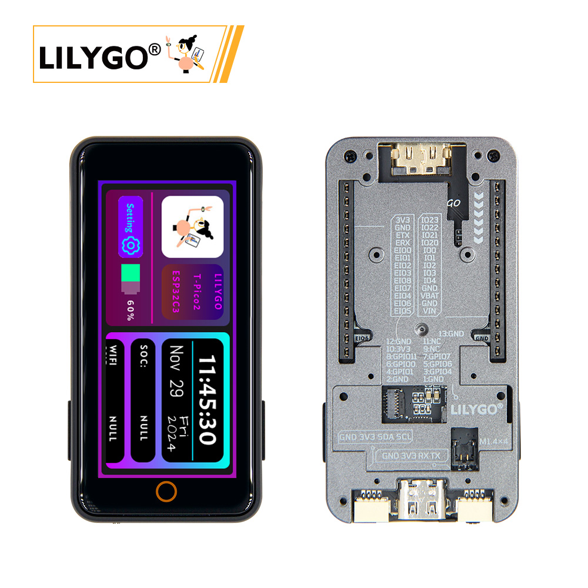
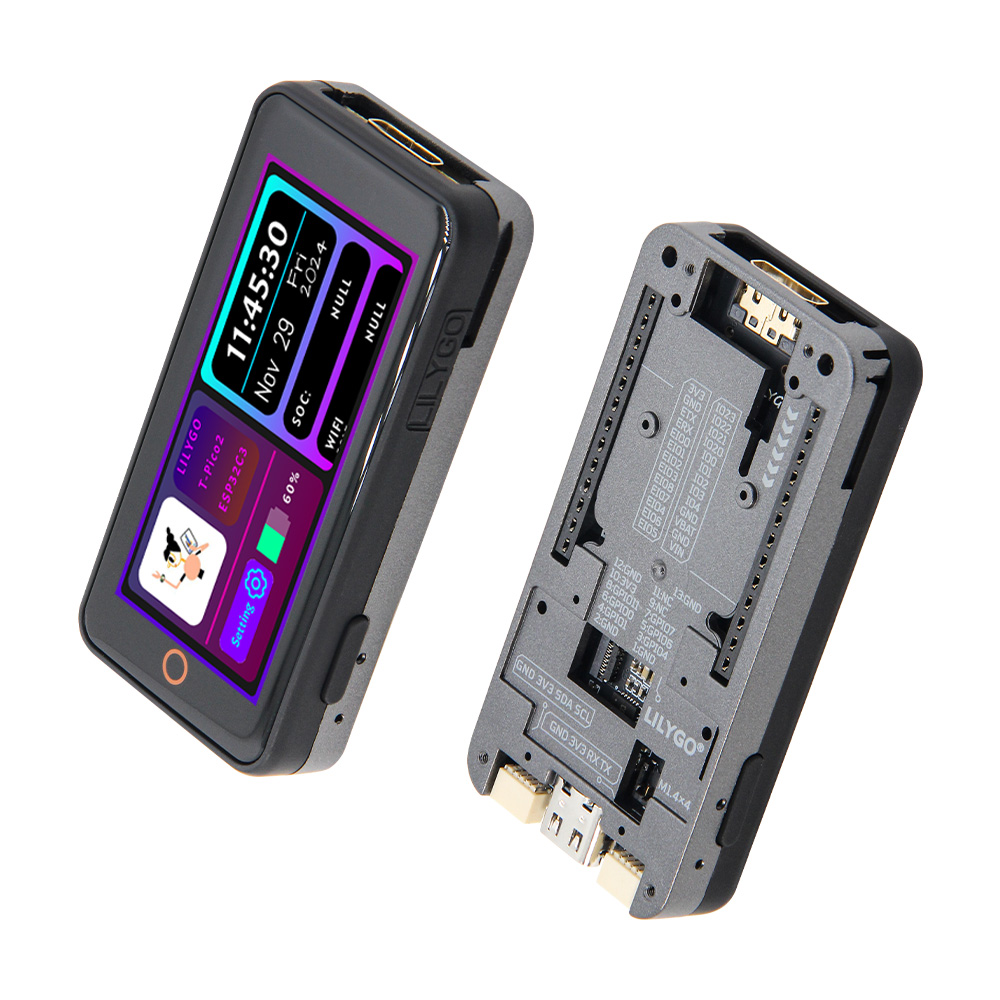
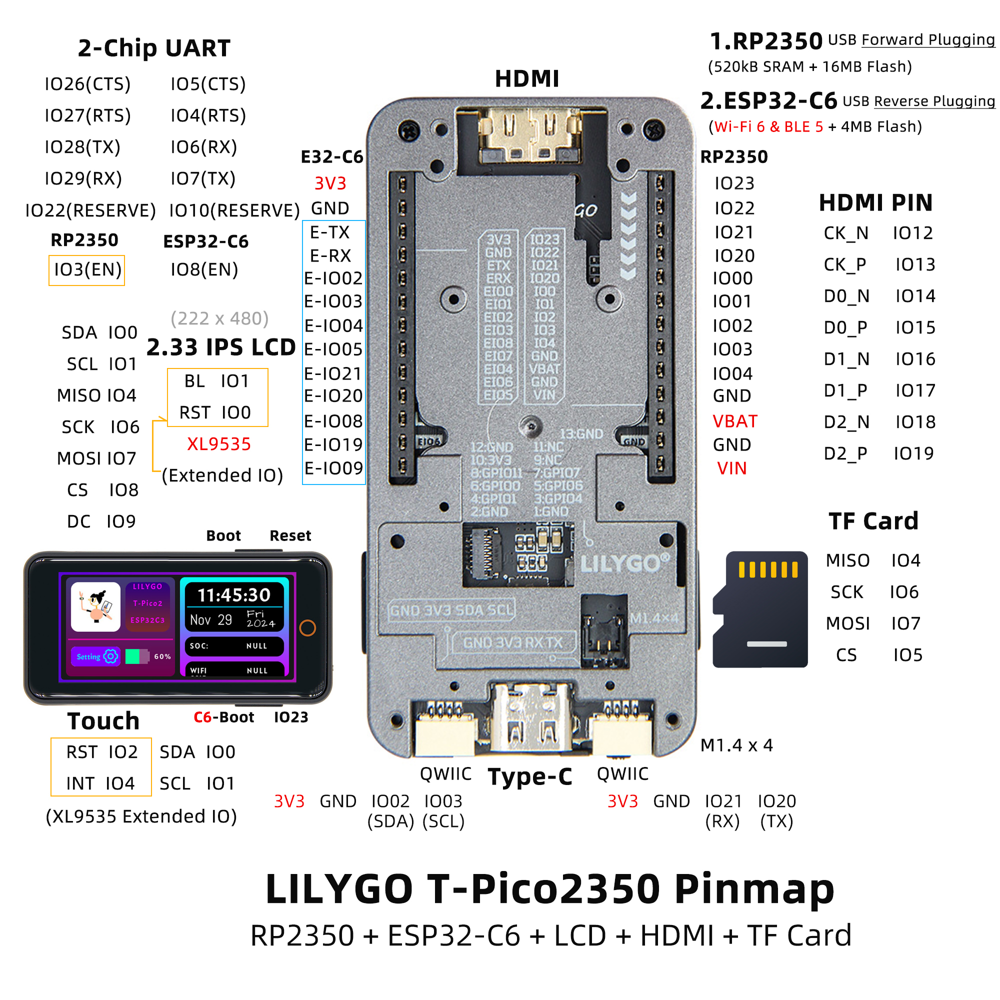

<!-- **[English](README.MD) | 中文** -->

<!-- 

    <a target="_blank" style="margin: 1em;color: white; font-size: 0.9em; border-radius: 0.3em; padding: 0.5em 2em; background-color:rgb(63, 201, 28)" href="https://item.taobao.com/item.htm?id=846226367137">淘宝</a>
    <a target="_blank" style="margin: 1em;color: white; font-size: 0.9em; border-radius: 0.3em; padding: 0.5em 2em; background-color:rgb(63, 201, 28)" href="https://www.aliexpress.com/store/911876460">速卖通</a>

 -->

## 简介

 T-Pico2350 是延续T-Pico系列的另外一款基于树莓派芯片RP2350设计制造的版本，采用T-Displya S3 Pro 外部扩展版本的外壳设计，这个外壳设计的特点是预留了多种外部功能扩展设计的接口，支持排母的扩展模式和13pin 0.3间距的FPC扩展接口模式，同时底部预留了多个M1.4的内嵌铜螺母用于底部扩展固定使用，集成了RP2350+ESP32-C6+2.33寸电容触摸屏+TF卡+HDMI接口+2个QWIIC接口+PMU，支持电池供电和USB供电，USB接口延续了T-Pico系列的设计，通过正反插可以对两个芯片进行编程。

## 外观及功能介绍
### 外观

### 引脚图 

## 模块资料以及参数
<table role="table" class="center_table">
  <thead>
    <tr>
      <th colspan = "2">树莓派模块</th>
    </tr>
  </thead>
    <tr>
    <td>CPU</td>
    <td>RP2350</td>
  </tr>
  <tr>
    <td>Flash</td>
    <td>16MB</td>
  </tr>
  <tr>
    <td>SRAM</td>
    <td>520kB</td>
  </tr>
</table>

<table role="table" class="center_table">
  <thead>
    <tr>
      <th colspan = "2">ESP32模块</th>
    </tr>
  </thead>
    <tr>
    <td>主控</td>
    <td>ESP32-C6-MINI-1U-N4</td>
  </tr>
  <tr>
    <td>Flash</td>
    <td>4MB</td>
  </tr>
  <tr>
    <td>无线协议</td>
    <td>2.4G WiFi 6 + 蓝牙(BLE)</td>
  </tr>
    <tr>
    <td>无线标准</td>
    <td>802.11b/g/n</td>
  </tr>
</table>

### 开发板参数
| 组件 | 描述 |
| ---  | --- |
| 存储 | TF 卡 |
| 屏幕 | 2.33英寸IPS LCD |
| 触摸 | XL9535 IIC协议 |
| HDMI | 19pin HDMI 接口 |
| IO 接口 | 2.54mm间距 × 2*13拓展IO接口 |
| 拓展接口 | 2 × QWIIC接口 |
| 孔位 | M1.4mm *4  |

### 相关资料
Github：[T-PICO-2350](https://github.com/Xinyuan-LilyGO/Lilygo-T-Pico2/tree/master)
* [Light Sensor datasheet](https://github.com/lewisxhe/SensorLib/blob/master/datasheet/LTR-553ALS-01.pdf)
* [RP2350](https://www.raspberrypi.com/documentation/microcontrollers/silicon.html#rp2350)
* [ST7796S](http://www.lcdwiki.com/res/MSP4021/ST7796S-Sitronix.pdf)
* [CST226SE](https://github.com/lewisxhe/SensorLib/blob/master/datasheet/%E6%B5%B7%E6%A0%8E%E5%88%9B%E8%A7%A6%E6%91%B8%E8%8A%AF%E7%89%87%E7%A7%BB%E6%A4%8D%E6%89%8B%E5%86%8C-v3.5-20220701(1).pdf)

#### 原理图

[T-Pico-2350](https://github.com/Xinyuan-LilyGO/Lilygo-T-Pico2/blob/master/hardware/T_Pico2350_V1.2.pdf)

<!-- * [SY6970](./datasheet/AN_SY6970.pdf) -->

#### 依赖库

* [lvgl 8.3.9](https://github.com/lvgl/lvgl)
* [AceButton](https://github.com/bxparks/AceButton)
* [TFT_eSPI](https://github.com/Bodmer/TFT_eSPI)
* [Arduino_GFX](https://github.com/moononournation/Arduino_GFX)
* [WiFiEspAT](https://github.com/jandrassy/WiFiEspAT)
* [XPowersLib](https://github.com/lewisxhe/XPowersLib)
* [SensorLib](https://github.com/lewisxhe/SensorsLib)
* [MPU9250](https://github.com/bolderflight/MPU9250)
* [Adafruit_BME280_Library](https://github.com/adafruit/Adafruit_BME280_Library)
* [TinyGPSPlus](https://github.com/mikalhart/TinyGPSPlus)

## 软件开发
### Arduino 设置参数

| Setting                               | Value                                 |
| :-------------------------------: | :-------------------------------: |
| Board                                 | Generic RP2350           |
| Debug Level                    | None                               |
| Debug Port                           | Serial     |
| C++ Exceptions            | Disabled                              |
| Flash size                 | 16MB (no FS)                           |
| CPU Speed                | 150 MHz                          |
| IP/Bluetooth stack                  | lPv4 Only                    |
| Optimize:                     | Small (-Os) (standard)                |
| PSRAM Size                           | OMByte PSRAM                    |
| RTTI                           | Disabled                    |
| Stack Protector                | Disabled |
| Upload Method                   | Default (UF2)           |
| USB Stack                   | Pico SDK                               |
     

### 开发平台
1. [C语言](https://github.com/Xk-w/Arduino_DriveBus)
2. [Arduino IDE](https://www.arduino.cc/en/software)
3. [Platform IO](https://github.com/Xk-w/Arduino_DriveBus)

## 产品技术支持 

