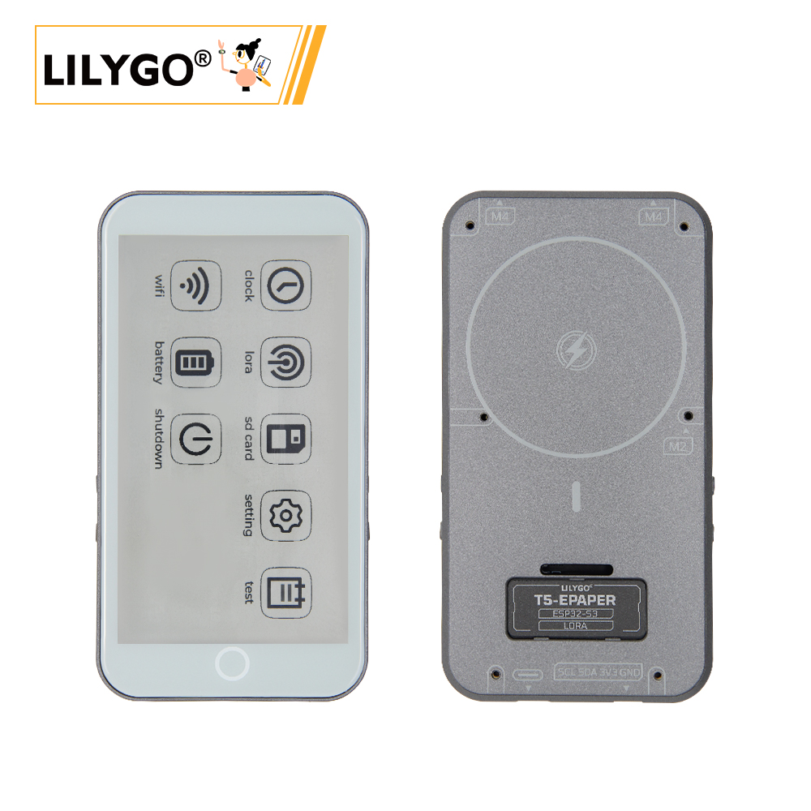
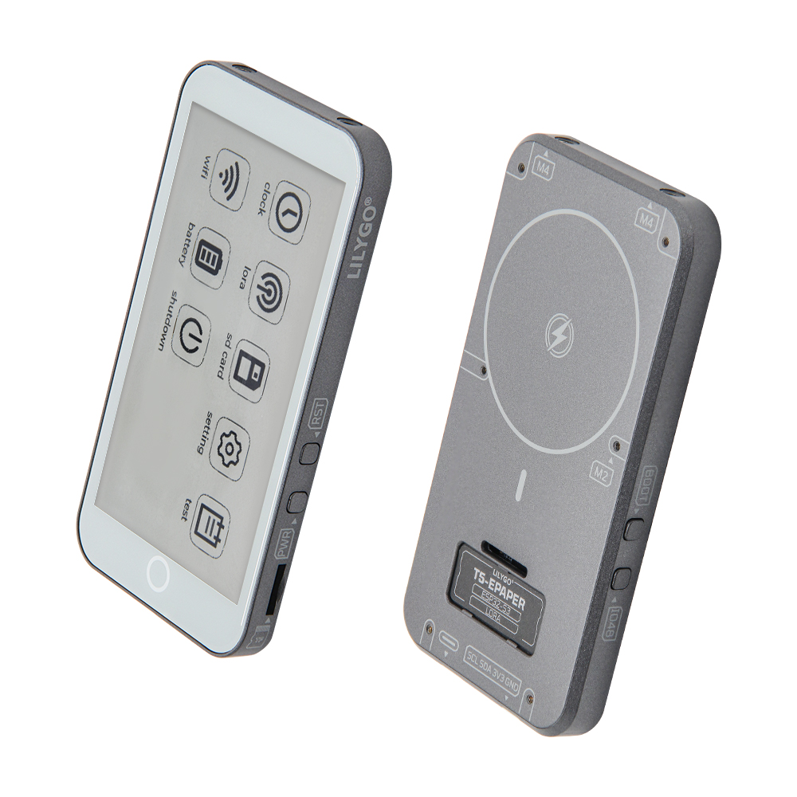
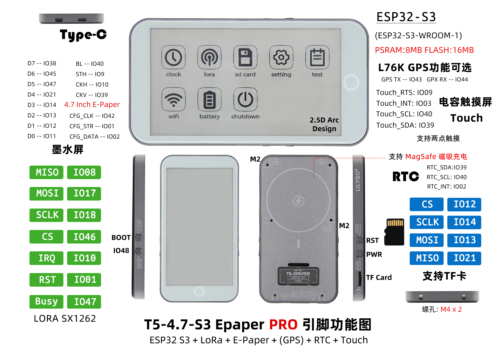

<!-- **[English](README.MD) | 中文** -->

<!-- 

    <a target="_blank" style="margin: 1em;color: white; font-size: 0.9em; border-radius: 0.3em; padding: 0.5em 2em; background-color:rgb(63, 201, 28)" href="https://item.taobao.com/item.htm?id=846226367137">淘宝</a>
    <a target="_blank" style="margin: 1em;color: white; font-size: 0.9em; border-radius: 0.3em; padding: 0.5em 2em; background-color:rgb(63, 201, 28)" href="https://www.aliexpress.com/store/911876460">速卖通</a>

 -->

## 简介

T5-4.7-S3 Epaper PRO 是一款多功能物联网设备，基于 ESP32-S3-WROOM-1 主控芯片（8MB PSRAM + 16MB FLASH）设计，集成 LoRa SX1262 远距离通信模块、4.7英寸电子墨水屏（低功耗持久显示）及电容式触摸屏（支持两点触控），可扩展 L76K GPS 模块（定位数据通过 TX/RX 引脚传输）与实时时钟（RTC）（SDA/SCL 引脚同步时间）。设备支持 MagSafe 磁吸充电便捷供电，内置 TF 卡扩展槽与 M4 螺孔（固定或外接配件），并通过丰富接口（SPI、UART 等）兼容传感器与外部设备，适用于电子标签、远程监测、户外导航等场景，兼具低功耗、高兼容性与交互灵活性。

## 外观及功能介绍
### 外观

### 引脚图 

## 模块资料以及参数
### 开发板参数

| 组件 | 描述 |
| ---  | --- |
|MCU	|ESP32-S3-WROOM-1
|Flash 	|16M 
|PSRAM  |8M
|Lora|	SX1262 433Mhz~915Mhz(可选)
|GPS	|MIA-M10Q
|无线| 2.4 GHz Wi-Fi& BLE 5
|存储 | TF 卡 |
|驱动 IC	|ED047TC1 (4.7 inches, 960x540 , 16 gray)
|电池容量 |	3.7V-1500mAh
|电池芯片	|BQ25896 (0x6B), BQ27220 (0x55)
|充电方式|磁吸充电(Magsafe) + USB充电
|触摸	|GT911 (0x5D)
|时钟	|PCF85063 (0x51)
| 按键 | 1 x RST 按键 + 1 x BOOT 按键 + 1 x IO48 按键 + 1 × PWR 按键|
|E-link Power Driver	|TPS65185 (0x68)
|IO 拓展	|PCA9535PW (0x20)
| 拓展接口 | 2 × QWIIC接口 |
| 孔位 | M4mm *2  |

### 相关资料
Github：[T5 E-paper S3 PRO](https://github.com/Xinyuan-LilyGO/T5S3-4.7-e-paper-PRO)
* [ED047TC1](https://github.com/Xinyuan-LilyGO/T5S3-4.7-e-paper-PRO/blob/H752-01/hardware/ED047TC1.pdf)
* [MIA-M10Q](https://github.com/Xinyuan-LilyGO/T5S3-4.7-e-paper-PRO/blob/H752-01/hardware/MIA-M10Q_DataSheet_UBX-22015849.pdf)
* [TPS65185](https://github.com/Xinyuan-LilyGO/T5S3-4.7-e-paper-PRO/blob/H752-01/hardware/tps65185.pdf)
* [CST226SE](https://github.com/lewisxhe/SensorLib/blob/master/datasheet/%E6%B5%B7%E6%A0%8E%E5%88%9B%E8%A7%A6%E6%91%B8%E8%8A%AF%E7%89%87%E7%A7%BB%E6%A4%8D%E6%89%8B%E5%86%8C-v3.5-20220701(1).pdf)

#### 原理图

[T5 E-paper S3 PRO](https://github.com/Xinyuan-LilyGO/T5S3-4.7-e-paper-PRO/blob/H752-01/hardware/T5%20E-paper%20S3%20Pro%20V1.0%2024-12-24.pdf)

<!-- * [SY6970](./datasheet/AN_SY6970.pdf) -->

#### 依赖库

* [epdiy](https://github.com/vroland/epdiy)                     
* [RadioLib@6.5.0](https://github.com/jgromes/RadioLib)       
* [XPowersLib@^0.2.3](https://github.com/lewisxhe/XPowersLib)   
* [TinyGPSPlus@^1.1.0](https://github.com/mikalhart/TinyGPSPlus) 
* [SensorLib@0.2.2](https://github.com/lewisxhe/SensorsLib)    
* [lvgl@^8.3.11](https://github.com/lvgl/lvgl/tree/v8.3.11)      

## 软件开发
### Arduino 设置参数

|Arduino IDE 设置	|参数   
| ----------- | -----------|                         
|Board     |	ESP32S3 Dev Module
|Port      |    Your port                        
|USB CDC On Boot	|Enable
|CPU Frequency	|240MHZ(WiFi)                      
|Core Debug Level	|None                              
|USB DFU On Boot	|Disable                          
|Erase All Flash Before Sketch Upload	|Disable                          
|Events Run On	|Core1                            
|Flash Mode	QIO |80MHZ                        
|Flash Size	|16MB(128Mb)                  
|Arduino Runs On	|Core1                            
|USB Firmware MSC On Boot	|Disable                          
|Partition Scheme	|16M Flash(3M APP/9.9MB FATFS)
|PSRAM	|OPI PSRAM                    
|Upload Mode	|UART0/Hardware CDC            
|Upload Speed	|921600                            
|USB Mode	|CDC and JTAG      

### 开发平台
1. [VS Code](https://code.visualstudio.com/)
2. [Arduino IDE](https://www.arduino.cc/en/software)

## 产品技术支持 

