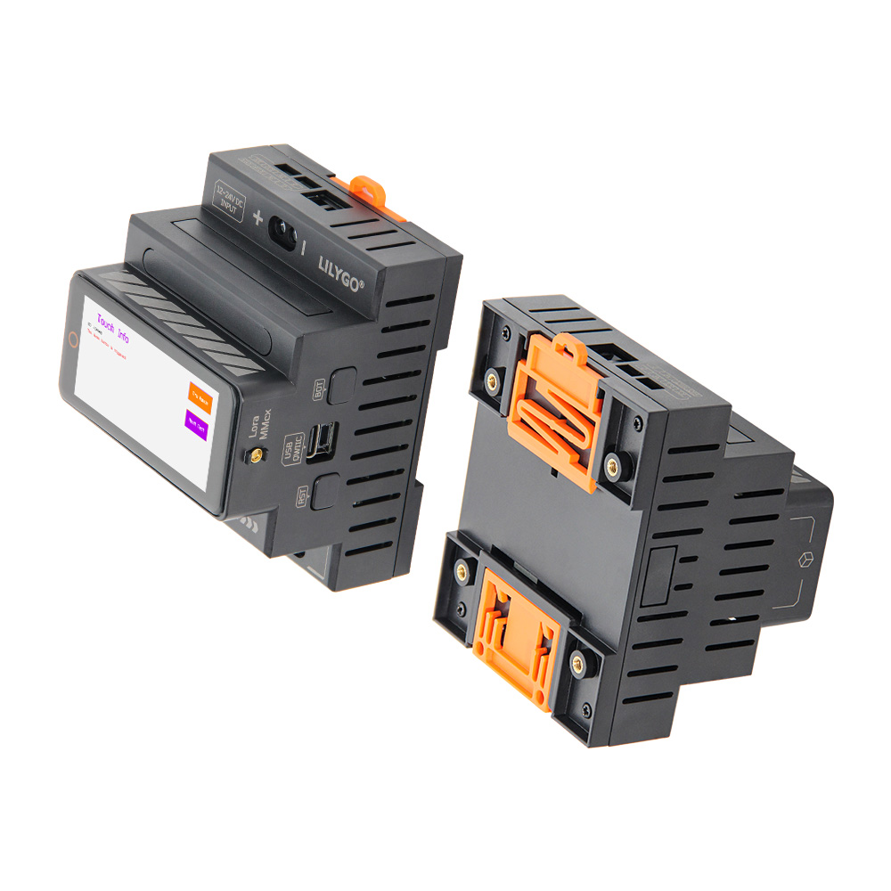
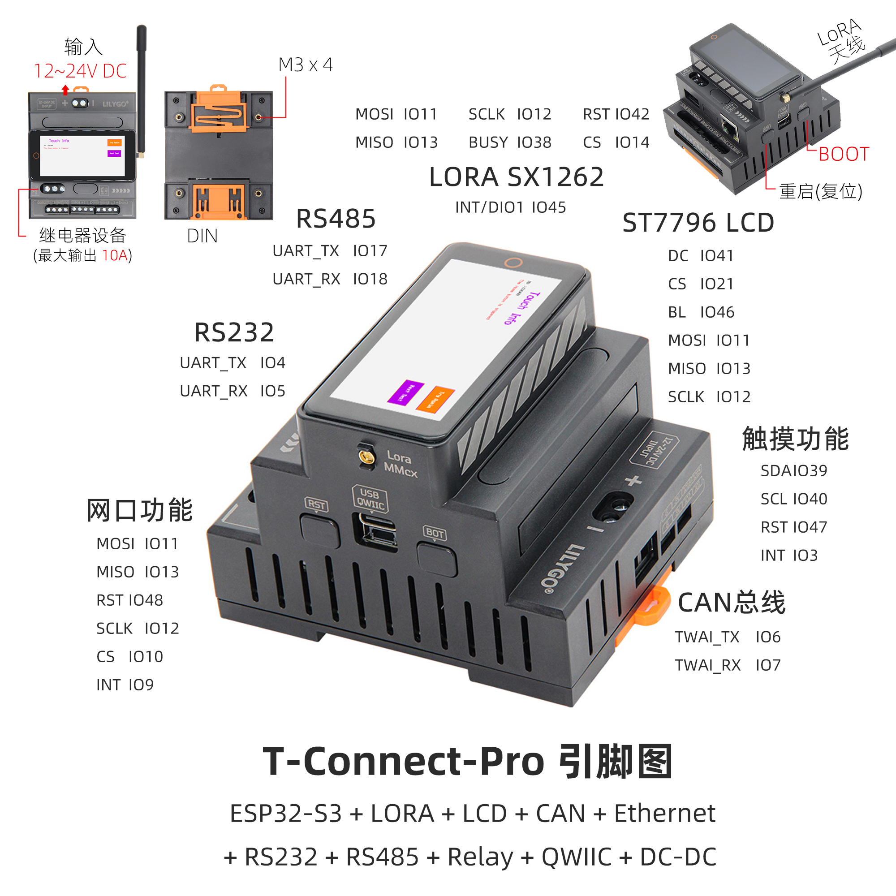

<!-- **[English](README.MD) | 中文** -->

## 简介

T-Connect-Pro 是一款基于 ESP32-S3 的多功能工业级控制与通信模块，集成 LoRa（SX1262 芯片）、ST7796 LCD 显示屏（分辨率及引脚 DC/CS/BL）、CAN总线、以太网接口及双串口（RS232/RS485），支持 12~24V 宽电压输入与 10A 继电器输出，适用于复杂工业自动化与物联网场景。其硬件配置涵盖 触摸功能（SDA/SCL/RST）、SPI 网口通信（MOSI/MISO/SCLK）、QWIIC 扩展接口及 DC-DC 电源管理，提供多协议通信（LoRa 远距离传输、CAN 总线控制）、实时数据显示（LCD）及设备联动控制（继电器）能力，可灵活适配智能工厂、远程传感、能源监控等领域的多样化需求，兼具高兼容性与稳定性

## 外观及功能介绍
### 外观

### 引脚图 

## 模块资料
### 概述

T-Connect-Pro基于主控芯片ESP32S3，由3层板子堆叠组合而成的产品，功能丰富多样，板载3种不同通信模块：CAN、RS485、RS232实现远距离传输，拥有一个以太网接口、一个继电器接口、一个Lora模块（SX1262），配备LCD屏幕使得操作更加便捷。

| 组件 | 描述 |
| --- | --- |
| MCU | ESP32-S3-R8 
| FLASH| 16MB |
| PS RAM | 8MB|
| 轴传感器 | BMA423 (IIC)|
| 以太网 | W5500 (SPI) |
| LoRa | HPD16A模块 SX1262芯片 支持频段：433~920HMZ(可选) |
| CAN | TD501MCANFD (TWAI) |
| RS485 | TD501D485H-A  (UART)|
| RS232 | TD501D232H  (UART)|
| 继电器 | 输出10A|
| 电源管理 | AXP2101 高度集成的电源管理单元 |
| USB | 1 × USB Port and OTG(TYPE-C接口) |
| 拓展接口 | 1 × QWIIC接口  |
| 按键 | 1 x RESET 按键 + 1 x BOOT 按键(内置) |
| 屏幕 | ST7796 TFT屏幕 222x480px(SPI)|
| 触摸 | CST226SE (IIC)|
| 电源 | 5V/500mA |
| 孔位 | **M3mm 螺丝孔 × 4** |
| 尺寸 | **带底座88x72x60mm**  |
### 相关资料链接

Github:[T-Connect-Pro](https://github.com/Xinyuan-LilyGO/T-Connect-Pro)

- [Espressif ESP32-S3 Datasheet](https://www.espressif.com.cn/sites/default/files/documentation/esp32-s3_datasheet_en.pdf)
- [HPD16A_V1.1](https://github.com/Xinyuan-LilyGO/T-Connect-Pro/blob/main/information/HPDTEK_HPD16A_TCXO_V1.1.pdf)
- [SX1262_V2.1](https://github.com/Xinyuan-LilyGO/T-Connect-Pro/blob/main/information/DS_SX1261-2_V2_1.pdf)
- [TD501MCANFD](https://github.com/Xinyuan-LilyGO/T-Connect-Pro/blob/main/information/TD501MCANFD_MORNSUN.pdf)
- [TD501D485H-A](https://github.com/Xinyuan-LilyGO/T-Connect-Pro/blob/main/information/TD501D485H-A_K-CUT.pdf)
- [TD501D232H](https://github.com/Xinyuan-LilyGO/T-Connect-Pro/blob/main/information/TD501D232H.pdf)

#### 原理图
[T-Connect-Pro](https://github.com/Xinyuan-LilyGO/T-Connect-Pro/blob/main/project/T-Connect-Pro_V1.0.pdf)

#### 依赖库
- 触摸: [Arduino_DriveBus-1.1.2](https://github.com/Xk-w/Arduino_DriveBus)
- LoRa: [RadioLib-6.6.0](https://github.com/jgromes/RadioLib)
- 屏幕:[Arduino_GFX](https://github.com/moononournation/Arduino_GFX)
- 以太网:[Ethernet_V2.0.0](http://www.arduino.cc/en/Reference/Ethernet)

## 软件开发
### Arduino 设置参数
|Setting|	Value|
| --------------| ------------ |
|Board	| ESP32S3 Dev Module
|Upload Speed	|921600
|USB Mode	|Hardware CDC and JTAG
|USB CDC On Boot	|Enabled
|USB Firmware MSC On Boot	|Disabled
|USB DFU On Boot|	Disabled
|CPU Frequency	|240MHz (WiFi)
|Flash Mode	|QIO 80MHz
|Flash Size	|16MB (128Mb)
|Core Debug Level|	None
|Partition Scheme	|16M Flash (3MB APP/9.9MB FATFS)
|PSRAM	|OPI PSRAM
|Arduino Runs On	|Core 1
|Events Run On	|Core 1
### 开发平台
1. [VS Code](https://code.visualstudio.com/)
2. [Arduino IDE](https://www.arduino.cc/en/software)
## 产品技术支持 

