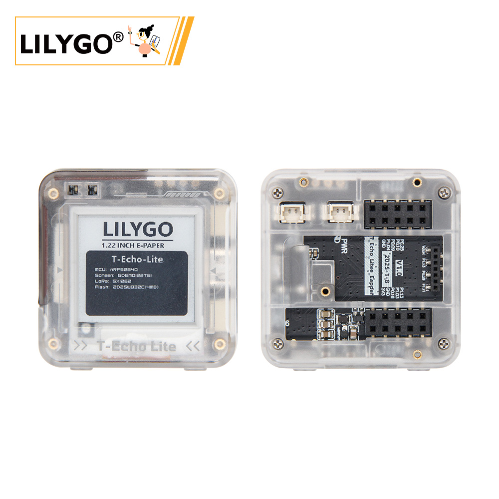

<!-- **[English](README.MD) | 中文** -->

<!-- 

    <a target="_blank" style="margin: 1em;color: white; font-size: 0.9em; border-radius: 0.3em; padding: 0.5em 2em; background-color:rgb(63, 201, 28)" href="https://item.taobao.com/item.htm?id=846226367137">淘宝</a>
    <a target="_blank" style="margin: 1em;color: white; font-size: 0.9em; border-radius: 0.3em; padding: 0.5em 2em; background-color:rgb(63, 201, 28)" href="https://www.aliexpress.com/store/911876460">速卖通</a>

 -->

## 概述

 T-Echo Lite是T-Echo的Lite版本，Lora+NRF52840+e-paper组合是目前验证过最低功耗的组合方案，可以作为Lora节点适配Meshtastic固件使用。
 T-Echo Lite分为T-Echo Lite Core和T-Echo Lite Base三个版本，T-Echo Lite主机是集成了T-Echo Lite Base的基础上设计了对应的外壳和集成1.2寸e-paper屏幕为一体的版本，支持选配GPS功能扩展模块。
 T-Echo lite core 是集成了NRF52840+LORA+太阳能+电池充放电电路的核心模块，采用小尺寸邮票孔设计，方便嵌入到不同应用的用户设备中。
 T-Echo Lite Base是基于Core模块设计制作的扩展板，将core模块的功能引出到bese扩展板上比如电池接口座，太阳能接口座，QWIIC和USB接口，1.22寸e-paper屏幕接口，同时可以选配GPS扩展模块功能，方便用户开发验证使用。

## 外观及功能介绍
### 外观

### 引脚图 

## 模块资料
### 概述

T-Echo-Lite是基于T-Echo的轻便版本，拥有比T-Echo更小的体积，更小的功耗设计，最低深度睡眠功耗可达2μA-10μA（不同板子由于板载元器件差异功耗的表现可能不同，这里最低功耗采用LILYGO实验室测定的工程板），板载丰富的功能，惯性传感器、LORA模块、太阳能充电功能（5V）、外置GPS等功能，及其优秀的功耗表现使得T-Echo-Lite能够拥有更为出色的续航。

<table role="table" class="center_table">
  <thead>
    <tr>
      <th colspan = "2">主控</th>
    </tr>
  </thead>
  <tr>
    <td>芯片</td>
    <td>nRF52840</td>
  </tr>
  <tr>
    <td>RAM</td>
    <td>256kB</td>
  </tr>
</table>

<table role="table" class="center_table">
  <thead>
    <tr>
      <th colspan = "2">屏幕</th>
    </tr>
  </thead>
  <tr>
    <td>名称</td>
    <td>GDEM0122T61</td>
  </tr>
  <tr>
    <td>尺寸</td>
    <td>1.22 英寸</td>
  </tr>
    <tr>
    <td>分辨率</td>
    <td>176x192px</td>
  </tr>
    <tr>
    <td>屏幕类型</td>
    <td>E-PAPER</td>
  </tr>
    <tr>
    <td>驱动芯片</td>
    <td>SSD1681</td>
  </tr>
    <tr>
    <td>总线通信协议</td>
    <td>IIC</td>
  </tr>
</table>

<table role="table" class="center_table">
  <thead>
    <tr>
      <th colspan = "2">LORA</th>
    </tr>
  </thead>
  <tr>
    <td>芯片模组</td>
    <td>S62F</td>
  </tr>
  <tr>
    <td>芯片</td>
    <td>SX1262</td>
  </tr>
    <tr>
    <td>通信协议</td>
    <td>SPI</td>
  </tr>
</table>

<table role="table" class="center_table">
  <thead>
    <tr>
      <th colspan = "2">GPS</th>
    </tr>
  </thead>
  <tr>
    <td>芯片</td>
    <td>L76K</td>
  </tr>
    <tr>
    <td>通信协议</td>
    <td>UART</td>
  </tr>
</table>

<table role="table" class="center_table">
  <thead>
    <tr>
      <th colspan = "2">惯性传感器</th>
    </tr>
  </thead>
  <tr>
    <td>芯片</td>
    <td>ICM20948</td>
  </tr>
    <tr>
    <td>通信协议</td>
    <td>IIC</td>
  </tr>
</table>

<table role="table" class="center_table">
  <thead>
    <tr>
      <th colspan = "2">Flash</th>
    </tr>
  </thead>
  <tr>
    <td>芯片</td>
    <td>ZD25WQ32CEIGR</td>
  </tr>
    <tr>
    <td>通信协议</td>
    <td>SPI</td>
  </tr>
</table>
<!-- | IMU | **板载六轴 IMU 传感器（三轴加速度+三轴角速度）** | -->
<!-- | RTC | **板载 BM8653 RTC 芯片+纽扣电池，断电时间仍然正确** | -->

### 相关资料链接

Github:[T-Echo-Lite](https://github.com/Xinyuan-LilyGO/T-Echo-Lite)

- [nRF52840_Datasheet](https://docs.nordicsemi.com/bundle/ps_nrf52840/page/keyfeatures_html5.html)
- [GDEM0122T61](https://github.com/Xinyuan-LilyGO/T-Echo-Lite/blob/main/information/GDEM0122T61.pdf)
- [SSD1681](https://github.com/Xinyuan-LilyGO/T-Echo-Lite/blob/main/information/SSD1681.pdf)
- [S62F](https://github.com/Xinyuan-LilyGO/T-Echo-Lite/blob/main/information/S62F.pdf)
- [L76KB-A58](https://github.com/Xinyuan-LilyGO/T-Echo-Lite/blob/main/information/L76KB-A58.pdf)
- [ICM20948](https://github.com/Xinyuan-LilyGO/T-Echo-Lite/blob/main/information/ICM20948.pdf)
- [ZD25WQ32CEIGR](https://github.com/Xinyuan-LilyGO/T-Echo-Lite/blob/main/information/ZD25WQ32CEIGR.pdf)

#### 原理图
- [T-Echo-Lite](https://github.com/Xinyuan-LilyGO/T-Echo-Lite/blob/main/project/T-Echo-Lite_V1.0/T-Echo-Lite-Eapper_V1.0.pdf)

#### 依赖库
- [Adafruit_EPD-4.5.5](https://github.com/Xinyuan-LilyGO/T-Echo-Lite/tree/main/libraries/Adafruit_EPD-4.5.5)
- [Adafruit_BusIO-1.16.1](https://github.com/Xinyuan-LilyGO/T-Echo-Lite/tree/main/libraries/Adafruit_BusIO-1.16.1)
- [Adafruit_SPIFlash-4.3.4](https://github.com/Xinyuan-LilyGO/T-Echo-Lite/tree/main/libraries/Adafruit_SPIFlash-4.3.4)
- [Adafruit-GFX-Library-1.11.10](https://github.com/Xinyuan-LilyGO/T-Echo-Lite/tree/main/libraries/Adafruit-GFX-Library-1.11.10)
- [RadioLib-6.6.0](https://github.com/Xinyuan-LilyGO/T-Echo-Lite/tree/main/libraries/RadioLib-6.6.0)
- [TinyGPSPlus-1.0.3a](https://github.com/Xinyuan-LilyGO/T-Echo-Lite/tree/main/libraries/TinyGPSPlus-1.0.3a)
- [ICM20948_WE-1.1.11](https://github.com/Xinyuan-LilyGO/T-Echo-Lite/tree/main/libraries/ICM20948_WE-1.1.11)

## 软件开发
### Arduino 设置参数

| Setting                               | Value                                 |
| :-------------------------------: | :-------------------------------: |
| Board                                 | Nordic nRF52840 DK           |

使用说明可参考[README](https://github.com/Xinyuan-LilyGO/T-Echo-Lite/blob/main/README_CN.md)
### 开发平台
1. [C语言](https://github.com/Xk-w/Arduino_DriveBus)
2. [Arduino IDE](https://www.arduino.cc/en/software)
3. [Platform IO](https://github.com/Xk-w/Arduino_DriveBus)

## 产品技术支持 

