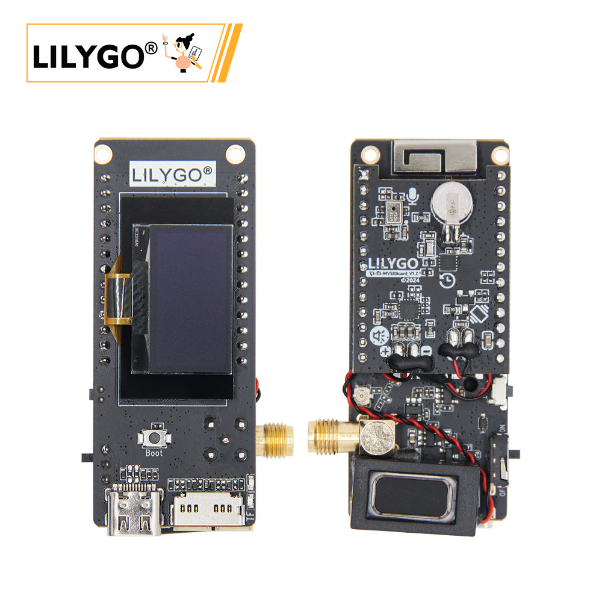

<!-- **[English](README.MD) | 中文** -->

<!-- 

    <a target="_blank" style="margin: 1em;color: white; font-size: 0.9em; border-radius: 0.3em; padding: 0.5em 2em; background-color:rgb(63, 201, 28)" href="https://item.taobao.com/item.htm?id=846226367137">淘宝</a>
    <a target="_blank" style="margin: 1em;color: white; font-size: 0.9em; border-radius: 0.3em; padding: 0.5em 2em; background-color:rgb(63, 201, 28)" href="https://www.aliexpress.com/store/911876460">速卖通</a>

 -->

## 简介

 T3-S3 MVSR版本是基于T3-S3主板设计了带有震动马达，麦克风，扬声器，RTC功能扩展模块的版本，这个版本的主要功能应用是用于lora 语音收发功能。
 这个扩展版本目前支持T3S3的SX1262和SX1280两个型号主板。
 SX1262版本使用的是FSK制式，SX1280使用的是LORA制式。
 在github上有对应的测试Demo供你开发参考使用。
 当然，这个扩展版本还可以用于一些AI语音交互功能，或者MP3播放等。

## 外观及功能介绍
### 外观

### 引脚图 

## 模块资料
### 概述
T3-S3-MVSRBoard 是针对 T3-S3_V1.2 主板的背板设计，具有板载扬声器和麦克风扩展功能，静态电流极低。此外，它还包含振动和 RTC（实时时钟）功能

<table role="table" class="center_table">
  <thead>
    <tr>
      <th colspan = "2">Speak</th>
    </tr>
  </thead>
  <tr>
    <td>芯片</td>
    <td>MAX98357A</td>
  </tr>
  <tr>
    <td>通信协议</td>
    <td>IIS</td>
  </tr>
</table>

<table role="table" class="center_table">
  <thead>
    <tr>
      <th colspan = "2">Microphone</th>
    </tr>
  </thead>
  <tr>
    <td>芯片</td>
    <td>MSM261S4030H0R</td>
  </tr>
  <tr>
    <td>通信协议</td>
    <td>PDM</td>
  </tr>
</table>

<table role="table" class="center_table">
  <thead>
    <tr>
      <th colspan = "2">RTC</th>
    </tr>
  </thead>
  <tr>
    <td>芯片</td>
    <td>PCF85063ATL</td>
  </tr>
  <tr>
    <td>通信协议</td>
    <td>IIC</td>
  </tr>
</table>
<!-- | IMU | **板载六轴 IMU 传感器（三轴加速度+三轴角速度）** | -->
<!-- | RTC | **板载 BM8653 RTC 芯片+纽扣电池，断电时间仍然正确** | -->

### 相关资料链接

Github:[T3-S3-MBSRBoard](https://github.com/Xinyuan-LilyGO/T3-S3-MVSRBoard)

- [MAX98357A](https://github.com/Xinyuan-LilyGO/T3-S3-MVSRBoard/blob/main/information/MAX98357AETE+T.pdf)
- [MSM261S4030H0R](https://github.com/Xinyuan-LilyGO/T3-S3-MVSRBoard/blob/main/information/MEMSensing-MSM261S4030H0R.pdf)
- [PCF85063ATL](https://github.com/Xinyuan-LilyGO/T3-S3-MVSRBoard/blob/main/information/PCF85063ATL-1,118.pdf)
- [MP34DT05-A](https://github.com/Xinyuan-LilyGO/T3-S3-MVSRBoard/blob/main/information/mp34dt05-a.pdf)

#### 原理图

[T3-S3-MVSRBoard](https://github.com/Xinyuan-LilyGO/T3-S3-MVSRBoard/blob/main/project/T3-S3-MVSRBoard_V1.0.pdf)

#### 依赖库
- [Speak](https://github.com/Xk-w/Arduino_DriveBus)
- [Microphone](https://github.com/Xk-w/Arduino_DriveBus)
- [RTC](https://github.com/Xk-w/Arduino_DriveBus)
## 软件开发
### Arduino 设置参数

| Setting                               | Value                                 |
| :-------------------------------: | :-------------------------------: |
| Board                                 | ESP32S3 Dev Module           |
| Upload Speed                     | 921600                               |
| USB Mode                           | Hardware CDC and JTAG     |
| USB CDC On Boot                | Enabled                              |
| USB Firmware MSC On Boot | Disabled                             |
| USB DFU On Boot                | Disabled                             |
| CPU Frequency                   | 240MHz (WiFi)                    |
| Flash Mode                         | QIO 80MHz                         |
| Flash Size                           | 16MB (128Mb)                    |
| Core Debug Level                | None                                 |
| Partition Scheme                | 16M Flash (3MB APP/9.9MB FATFS) |
| PSRAM                                | OPI PSRAM                         |
| Arduino Runs On                  | Core 1                               |
| Events Run On                     | Core 1                               |           

### 开发平台
1. [C语言](https://github.com/Xk-w/Arduino_DriveBus)
2. [Arduino IDE](https://www.arduino.cc/en/software)
3. [Platform IO](https://github.com/Xk-w/Arduino_DriveBus)

## 产品技术支持 

