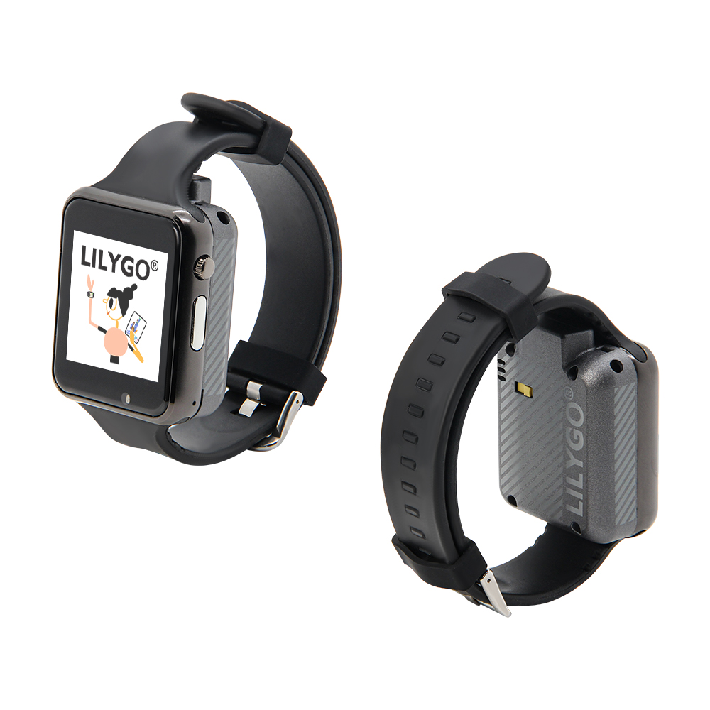
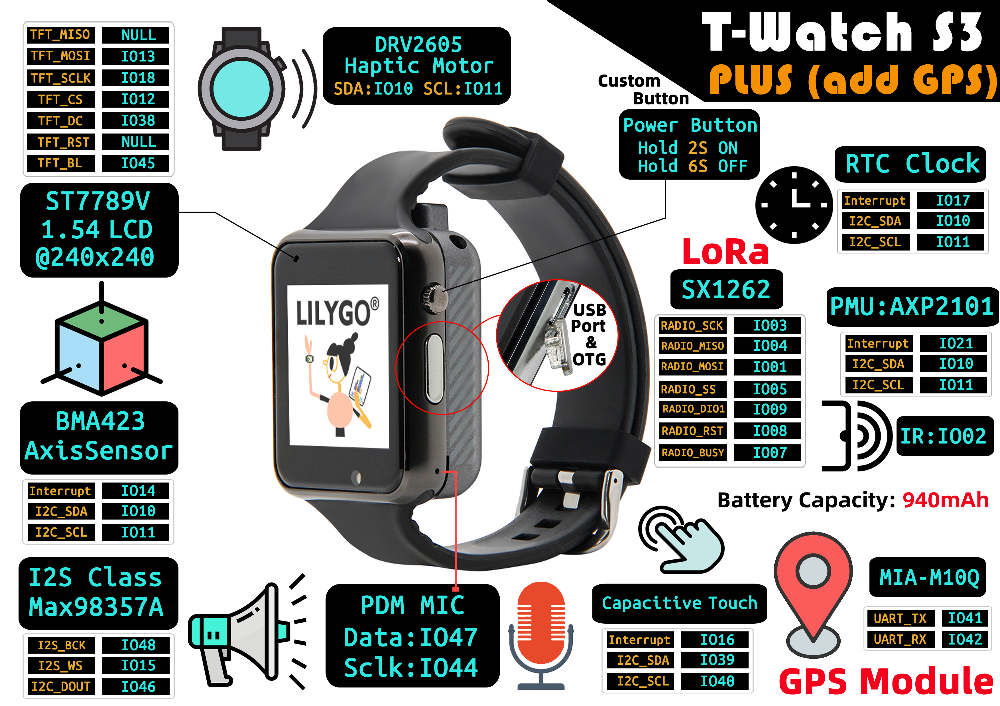

<!-- **[English](README.MD) | 中文** -->

<!-- 

    <a target="_blank" style="margin: 1em;color: white; font-size: 0.9em; border-radius: 0.3em; padding: 0.5em 2em; background-color:rgb(63, 201, 28)" href="https://item.taobao.com/item.htm?id=846226367137">淘宝</a>
    <a target="_blank" style="margin: 1em;color: white; font-size: 0.9em; border-radius: 0.3em; padding: 0.5em 2em; background-color:rgb(63, 201, 28)" href="https://www.aliexpress.com/store/911876460">速卖通</a>

 -->

## 简介

T-Watch S3 的Plus版本是基于T-Watch S3的基础上增加了GPS功能，与T-Watch S3同样的是一款多功能智能可穿戴设备，集成了高性能硬件与无线通信技术，适用于运动健康监测、远程交互及音频场景。
其核心配置包括1.54英寸240x240高清LCD显示屏，搭配BMA423轴传感器和电容式触摸模块，可精准追踪运动轨迹并提供灵敏触控操作，内置Max98357A音频放大器与PDM麦克风，支持高质量音频输出及语音指令输入。
目前T-Watch S3 Plus有1262和1280两个版本，结合RFC时钟模块，实现远距离低功耗无线通信，适用于物联网与工业传感场景。
紧凑的设计融合运动追踪、语音交互、远程通信等功能，适合户外探险、健康监测及智能家居控制等多元化场景，兼具科技感与实用性。

## 外观及功能介绍
### 外观

### 引脚图 

## 模块资料
### 概述

T-Watch S3 Plus满足了想要在可穿戴设备中试验LoRa和ESP32 S3技术的开发人员的需求，高度可定制且可用于各种应用程序。

| 组件 | 描述 |
| --- | --- |
| MCU | ESP32-S3 |
| FLASH| 16MB |
| PS RAM | 8MB|
| RTC | 8MB|
| 轴传感器 | BMA423 (IIC)|
| 无线 | Wi-Fi: 802.11 b/g/n; BLE V5.0 |
| LoRa | SX1262，SX1280 支持频段：433~923HMZ(可选) |
| 电机 | DRV2605  (IIC)|
| 电源管理 | AXP2101 高度集成的电源管理单元 |
| USB | 1 × USB Port and OTG(micro接口) |
| 按键 | 1 x POWER 按键(按住两秒开机，按住六秒关机) + 1 x BOOT 按键(内置) |
| 音频输出 | Max98357A(IIC) |
| 音频输入 | PDM MIC |
| 屏幕 | 1.54英寸LCD屏幕 240 × 240(SPI)|
| 触摸 | 电容触摸屏 (IIC)|
| 电源 | 5V/500mA 输入|
| 尺寸 | **不带表带 51.5x42x20mm**  |
### 相关资料链接

Github:[T-Watch S3 Plus](https://github.com/Xinyuan-LilyGO/TTGO_TWatch_Library/)

#### 原理图

[T-Watch S3 Plus](https://github.com/Xinyuan-LilyGO/TTGO_TWatch_Library/blob/t-watch-s3/schematic/T_WATCH_S3.pdf)

#### 依赖库
- [TTGO_TWatch_Library](https://github.com/Xinyuan-LilyGO/TTGO_TWatch_Library/tree/t-watch-s3)

## 软件开发
### Arduino 设置参数

| Setting                               | Value                                 |
| :-------------------------------: | :-------------------------------: |
| Board                                 | ESP32S3 Dev Module           |
| Upload Speed                     | 921600                               |
| USB Mode                           | UART0/Hardware CDC     |
| USB CDC On Boot                | Enabled                              |
| USB Firmware MSC On Boot | Disabled                             |
| USB DFU On Boot                | Disabled                             |
| CPU Frequency                   | 240MHz (WiFi)                    |
| Flash Mode                         | QIO 80MHz                         |
| Flash Size                           | 16MB (128Mb)                    |
| Core Debug Level                | None                                 |
| Partition Scheme                | 16M Flash (3MB APP/9.9MB FATFS) |
| PSRAM                                | OPI PSRAM        |
| Arduino Runs On                  | Core 1                               |
| Events Run On                     | Core 1         |           

### 开发平台

1. [ESP-IDF](https://www.espressif.com/zh-hans/products/sdks/esp-idf)
2. [Arduino IDE](https://www.arduino.cc/en/software)
3. [VS Code](https://code.visualstudio.com/)
4. [Micropython](https://micropython.org/)

## 产品技术支持 

